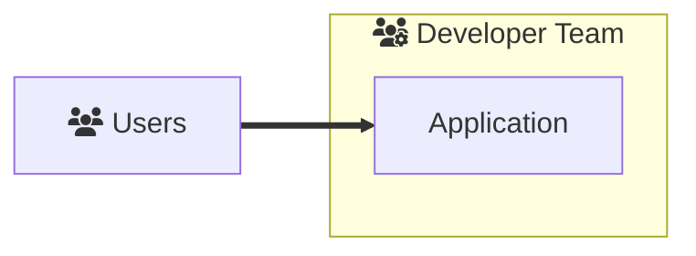
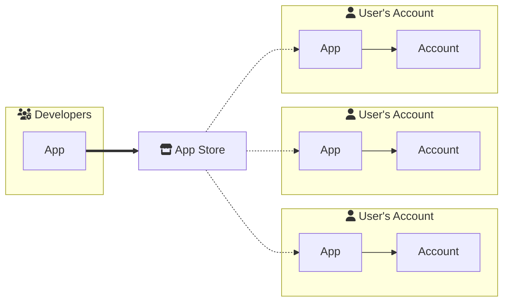

# The Abstract SDK Design Space

The first step to using a tool is learning its purpose and capabilities. Working with the Abstract SDK is no different. This page will help you understand the design space that the Abstract SDK operates in, which will help you reason about how to use the SDK effectively.

## Design Space

The Abstract SDK design space is a superset of the classical smart-contract design space, meaning that any application built with stand-alone smart-contracts can be implemented with the SDK as well. However, Abstract's design space is unique in that it allows for a level of code re-usability that would not be possible with stand-alone smart-contracts. By thinking about on-chain functionality in a functional sense, we created a system where application development can be done in a more conceptual way.

Additionally the SDK allows for software distribution that is unparalleled in the smart-contract space. With the Abstract SDK you can write your code once, deploy it to any blockchain that supports CosmWasm and let other developers **and users** use it within minutes. This opens up the possibility of creating a marketplace for smart-contracts, where developers can sell their code to other developers and users in a permissionless way.

This section will give you a high-level overview of the different approaches and how they can be used to build your application.

### Hosted Applications

Hosted applications are traditionally applications that are built using stand-alone smart-contracts. Examples of these types of applications are dexes, lending markets, yield aggregators, etc. What makes these applications *hosted* is that they are deployed by the maintainers of the application and often require the user to transfer funds to the application's smart-contract in order to use it.

### Self-Hosted Applications

By self-hosted applications we mean applications that are **fully** owned by the user. This means that the user does not have to transfer funds to the application's smart-contract in order to use it. Instead the user can deploy the application's smart-contract to their own account and use it from there. This is a novel concept that is only possible with the Abstract SDK.

This two main benefits:

- **Sovereignty:** There are less trust assumptions that the user has to make. The user does not have to trust the application's maintainers to not steal their funds.
- **Customizability:** The user can customize the application to their liking. Applications that take this design in mind can provide novel customization options that would not be possible with hosted applications.
