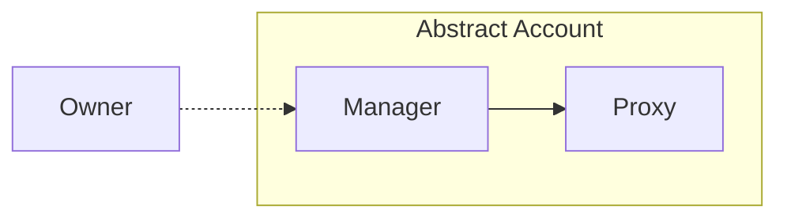
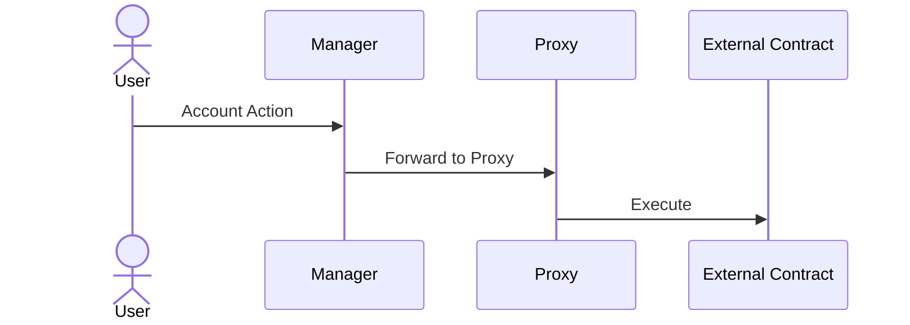

# Abstract Account Architecture

## Introduction

Abstract's account architecture is skillfully designed, merging modularity, scalability, and security. This architectural design is anchored by the ideas of account abstraction. For a detailed exploration of account abstraction, read [the preceding chapter](./3_account_abstraction.md). In the upcoming sections, we will delve deeper into the architecture of Abstract Accounts, providing insights into its design principles and components.

## Abstract Account

The Abstract SDK provides users with a sovereign *smart-contract wallet*. We call this smart-contract wallet an `Abstract Account`. The account's architecture has two primary components (smart-contracts): the **Manager** contract and the **Proxy** contract.



The *owner* of the account can configure the account by sending messages to the manager contract. We don't make any assumptions about the nature of this owner, it can be a wallet, multi-sig or any other ownership structure, allowing you to customize your account's ownership to fit your needs.

```admonish info
You can read up on the different ownership structures in our [Ownership](./5_ownership.md) section.
```

The account's architecture centers around **configurable programmability**. I.e. how can one configure the account (install applications, set permissions, etc.) to enable users and developers to easily configure/program it to do what they want? Let's see how the account architecture achieves this.

### Manager Contract

The *Manager* serves as the orchestrator of the Abstract Account. It is responsible for various important operations, including:

- **Owner Authentication**: Authenticating privileged calls and ensuring only approved entities can interact with the account.
- **Application Management**: Managing and storing information about the applications installed on the account, their inter-dependencies, permissions and configurations.
- **Account Details**: Storing the account's details, such as its name, description, and other relevant information.

> The *Manager* is responsible for the account's configuration and security.

### Proxy Contract

The *Proxy* serves as the asset vault of the Account, taking care of:

- **Asset Management & Pricing**: Holding the account's assets, including tokens, NFTs, and other fungible and non-fungible assets as well as allows for pricing assets based on decentralized exchange or oracle prices.
- **Transaction Forwarding (Proxying)**: Routing approved transactions from the **Manager** or other connected smart-contracts to other actors.

> The *Proxy* is responsible for the account's programmability and assets management.

### Account Interactions

The diagram below depicts a User interacting with their account through the **Manager**, and proxying a call to an external contract through the **Proxy**.



```admonish info
Not interested in account ownership? Skip to our section on [Modularity in Abstract](./6_modularity.md).
```
