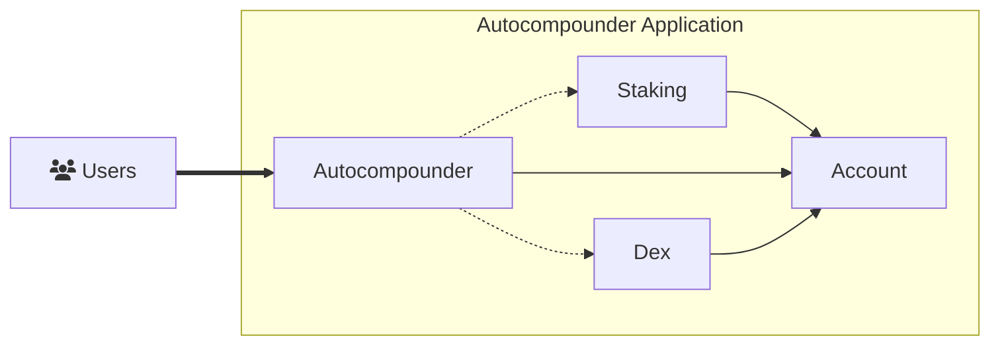

# Abstract SDK - Overview

The Abstract SDK is at the core of the Abstract development platform. It's a modular smart-contract framework designed to simplify and accelerate the development of CosmWasm dApps. It does this by prioritizing re-usability and composability through an account-abstraction oriented architecture.

From a high-level perspective, smart-contracts built with abstract can use on-chain dependencies (other smart-contracts) to isolate specific functionalities. In this way a smart-contract built with the Abstract SDK can explicitly define its dependencies and use them to perform complex multi-contract interactions with very minimal code. This in turn allows you to focus on the novel functionality of your application without inheriting the complexity of the underlying infrastructure.

## Visual Example

Visually this can be represented as an application, for example an `Autocompounder`, that has a dependency on one or multiple other smart-contracts. In this case a `Dex` and `Staking` module.

Each full arrow signifies execution permissions of the contract on the account. It allows the contract to move funds, interact with other contracts through the account and perform other actions. It does this by sending messages to the account, which then executes them on behalf of the contract. This is the basic idea behind account abstraction and is further elaborated in on the [account abstraction](./3_account_abstraction.md) page.

Each dotted arrow indicates a dependency between the contracts. These dependencies are explicitly defined in the contract and are asserted at contract instantiation. In this example the autocompounder contract is able to access specific functionality (like swapping or staking assets) from its dependencies (the dex and staking contracts). Through this a major reduction in code complexity and size is achieved as otherwise every dex or yield provider would have to be integrated with the autocompounder contract itself.

From a developer ecosystem standpoint this encourages collaboration and cross-team code re-use, a practice that has been proven to accelerate development and increase productivity. As the saying goes, a rising tide lifts all boats.

<!-- ## What Problem Does it Solve?

The Abstract SDK is designed to solve the following problems:

- **Reusability:** CosmWasm development has been a start-from-scratch process up until now. The Abstract SDK allows developers to reuse components across multiple dApps, reducing development time, increasing productivity, iteration speed and shortening the go-to-market of your ideas.

- **Security:** The Abstract SDK is built on top of the CosmWasm smart-contract framework, which is a battle-tested and highly secure platform. Because of its modular design, it's also easier to audit and test. Audited components can be reused across multiple dApps, reducing the risk of bugs and vulnerabilities.

- **Complexity:** The Abstract SDK simplifies the development process by providing a modular framework that allows developers to focus on the core functionality of their dApp.

- **Compatibility:** The Abstract SDK is designed to work seamlessly with popular on-chain services in the Cosmos ecosystem, decentralized exchanges, money markets, oracles, etc.

- **Interoperability:** The Abstract SDK is chain-agnostic, allowing developers to build dApps that can interact with multiple blockchains within the Cosmos ecosystem.

- **Scalability:** The Abstract SDK is designed to scale with the needs of the developer, allowing them to easily deploy to new networks, iterate on their product and achieve product market fit. Through its novel on-chain application store it also allows for personalized dApps that can be customized by the user to meet their specific needs, making the Abstract SDK the first decentralized software distribution platform.

- **Collaboration:** The Abstract SDK enables developers to collaborate on the creation of dApps its composable architecture and the ability to easily publish testing infrastructure for mock environment construction. -->
