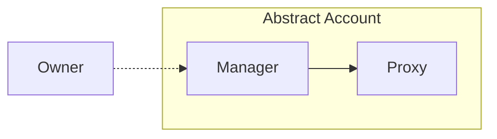
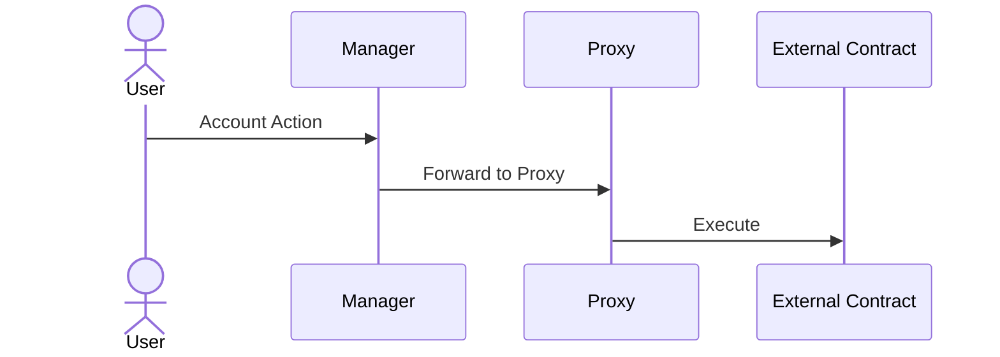

# Abstract Account Architecture

## Introduction

Abstract's architecture revolves around the powerful combination of modularity, scalability, and security in decentralized applications. At the core of this architecture is the concept of account abstraction, which forms the foundation of Abstract's functionality. For a detailed exploration of account abstraction, we recommend reading the overview of [Account Abstraction](./account_abstraction.md) . In the upcoming sections, we will delve deeper into the architecture of Abstract Accounts, providing insights into its design principles and components.

## Abstract Account

The Abstract platform provides users with a *smart-contract wallet*. We call this smart-contract wallet an `Abstract Account`. The account's architecture has two primary components (smart-contracts): the **Manager** contract and the **Proxy** contract.



The *owner* of the account can configure the account by sending messages to the manager contract. We don't make any assumptions about the nature of this owner, it can be a wallet, multi-sig or any other ownership structure, allowing you to customize your account's ownership.

```admonish info
You can read up on the different ownership structures in our [Ownership](./5_ownership.md) section.
```

The account's architecture centers around **configurable programmability**. I.e. how can I configure the account (install applications, set permissions, etc.) to enable me to easily program it to do what I want? Let's see how the account architecture achieves this.

### Manager Contract

The Manager serves as the orchestrator of the Abstract Account. It is responsible for various important operations, including:

- **Owner Authentication**: Authenticating privileged calls and ensuring only approved entities can transact with the account.
- **Application Management**: Managing and storing information about the applications installed on the account, their inter-dependencies, permissions and configurations.
- **Account Details**: Storing the account's details, such as its name, description, and other relevant information.

### Proxy Contract

The Proxy serves as the asset vault of the Account, taking care of:

- **Asset Management & Pricing**: Holding the account's assets, including tokens, NFTs, and other fungible and non-fungible assets. Also allows for pricing assets based on dex exchange prices.
- **Transaction Forwarding (Proxying)**: Routing approved transactions from the **Manager** or other connected smart-contracts to the network.
- **Interaction Interface**: Acting as the primary interface for external contracts and services to interact with the Account's funds.

### Account Interactions

The diagram below depicts the User interacting with their account through the **Manager**, and proxying a call to an external contract through the **Proxy**.



```admonish info
Not interested in account ownership? Skip to [modularity in Abstract](./6_modularity.md).
```
