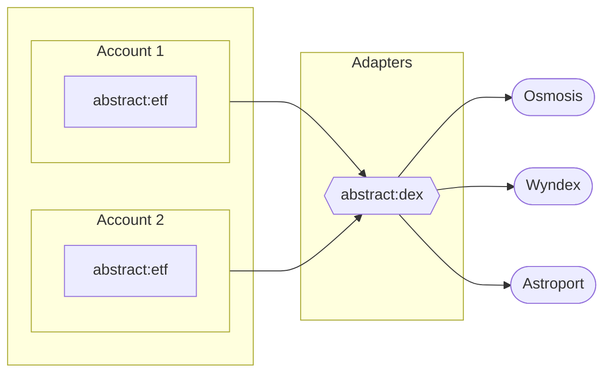

# Module Types

Within Abstract, a _module_ is a contract that **adds functionality** to your Account. You can explore all the available modules on the modules tab of your Account through the [web-app](https://app.abstract.money/).

Modules are classified in the following categories:

- **App**: modules that add an additional functionality, exposing new entry-points for you or your users
- **Adapter**: modules that act as a standard interface between your Account and external services
- **Standalone**: modules not built within Abstract, but registered to your account so that the manager can execute commands on them

## Adapters

Adapters serve as standard interfaces that facilitate communication between your Abstract Account and various external services. They act like bridges, enabling your account to interact with different smart-contract and blockchain services, thereby enhancing the interoperability of your applications.

The key function of an Adapter is to generalize functionality. Regardless of the underlying blockchain or smart contract protocol, the Adapter provides a standard interface that maintains consistency and simplifies the interaction process. As such, Adapters significantly simplify the developer experience and reduce the time required to integrate with various external systems.

Unlike other modules specific to each Abstract Account, Adapters are "global" in nature. This means that they are shared between multiple accounts. Due to this, **Adapter modules are not migratable**. This design choice is aimed at preventing supply-chain attacks that could potentially compromise the security of the Abstract ecosystem.

While individual Abstract Account owners can decide which Adapters and versions they wish to utilize, the overall control and maintenance of Adapters are handled at a platform level. This approach ensures that Adapters remain reliable, secure, and consistent across all Accounts.

> The `abstract:dex` module allows Accounts to access standard functions on dexes with the same interface, regardless of whether they're local to the chain or across IBC.

## Apps

An App module adds additional functionality to your Abstract Account, exposing new entry-points for you or your users. This could range from adding advanced financial logic, data management features, or complex computation capabilities, depending on your application's needs.

Each App module is exclusive to a single Abstract Account, meaning the instance is owned by the Account owner, ensuring the owner has full control over the module's functionality and lifecycle. This level of control extends to the management of upgrades, maintenance, and any customization that might be required for the specific use case of the application.

Because each Account has its own instance, App modules can be tightly integrated with the Account's existing infrastructure. This includes the ability to interact directly with other modules within the same account, enabling powerful synergies and cross-module functionality.

> The `abstract:etf` module is an app that exposes entry-points allowing external users to buy and sell "shares" in your Account, representing a portion of the Accounts' value.

<figcaption align = "center"><b>Two Accounts with the <code>abstract:etf</code> and <code>abstract:dex</code> modules installed</b></figcaption>
------

<!-- TODO: below is not reviewed

## How to Use Modules in Your Project

Leveraging modules in your project can significantly simplify the development process, allowing you to deploy projects faster and more cost-effectively than building traditionally. By using pre-built, tested, and community-reviewed modules, you can focus on your project's unique features while reducing development time and minimizing potential bugs.

Here's an example of how modules can be leveraged for a decentralized finance (DeFi) project:

Imagine you want to create a DeFi application with the following features:

- A fungible token for your platform
- Staking and delegation functionality
- A governance system for community-driven decision-making
- Integration with an oracle for fetching off-chain data

Instead of building each feature from scratch, you can leverage Abstract's off-the-shelf modules to implement these functionalities with ease. This not only saves time and resources but also ensures that your project benefits from the best practices established by the Abstract community.

**Step 1:** Choose the relevant modules from the Abstract library, such as:
Token Module for fungible tokens
Staking Module for staking and delegation
Governance Module for creating a governance system
Oracle Module for integrating with an oracle service

**Step 2:** Import the chosen modules into your project and configure them according to your requirements. This can include setting custom parameters, such as token supply, staking rewards, or voting thresholds.

**Step 3:** Integrate the modules with your existing codebase, ensuring they work seamlessly with your project's unique features. This can involve calling module functions, implementing hooks, or extending your data structures.

**Step 4:** Test your dApp thoroughly to ensure the modules function as intended and do not introduce any unexpected behavior.

By leveraging Abstract's modules in this way, you can rapidly build and deploy your DeFi project while benefiting from the robustness and flexibility of the Abstract ecosystem. -->
