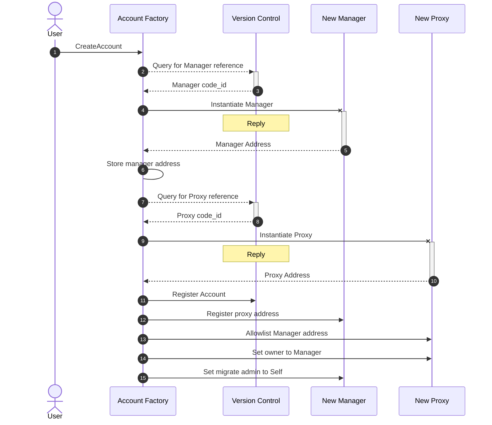

# Create Account
Below you can find the internal flow when the user requests that an account be created.

```mermaid
sequenceDiagram
  autonumber
  actor U as User
  participant F as Account Factory
  participant VC as Version Control
  participant M as New Manager
  participant P as New Proxy

  U->>F: CreateAccount
  F-->>+VC: Query for Manager reference
  VC-->>-F: Manager code_id
  

  F-x+M: Instantiate Manager
  Note over VC: Reply
  M-->>-F: Manager Address
  F->F: Store manager address


  F-->>+VC: Query for Proxy reference
  VC-->>-F: Proxy code_id
  F-x+P: Instantiate Proxy
    Note over VC: Reply
  P-->>-F: Proxy Address
  

  F->>VC: Register Account
  F->>M: Register proxy address
  F->>P: Allowlist Manager address
  F->>P: Set owner to Manager
  F->>M: Set migrate admin to Self


```
