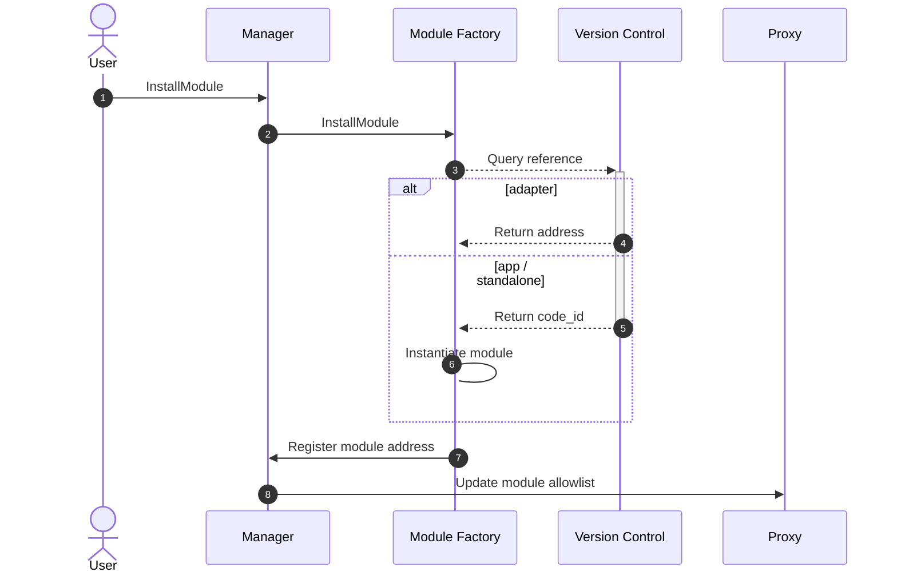

# Install Module

```mermaid
sequenceDiagram
  autonumber
  actor U as User
  participant M as Manager
  participant MF as Module Factory
  participant VC as Version Control
  participant P as Proxy

  U->>M: InstallModule
  M->>MF: InstallModule
  MF-->>+VC: Query reference
  alt adapter
    VC-->>+MF: Return address
  else app / standalone
    VC-->>-MF: Return code_id
    MF->MF: Instantiate module
  end
  MF->>M: Register module address
  
  M->>P: Update module allowlist
```
