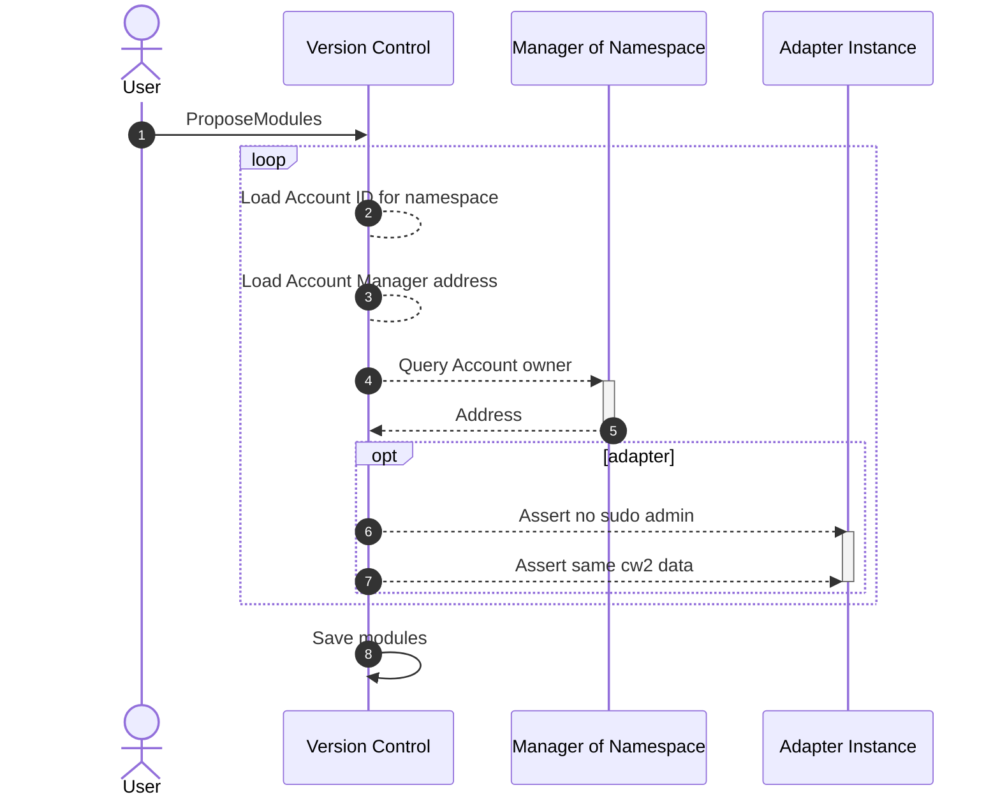

# Propose Modules
Developers that wish to publish modules to the Abstract platform need to call `ProposeModules` on the [Version Control](../../platform/version_control.md) contract. The modules will subsequently be reviewed by the Abstract platform for registration.

> For documentation on how to register modules, see [Module Deployment](../../4_get_started/module_deployment.md)

Modules cannot be registered without their namespaces being claimed by an Account. This is to prevent malicious actors from registering modules under trusted namespaces.

Below details the assertion process.

