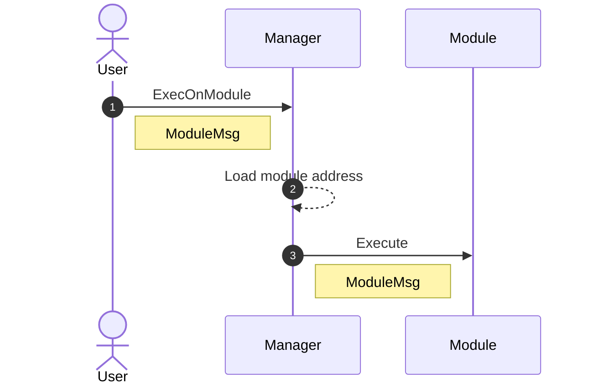
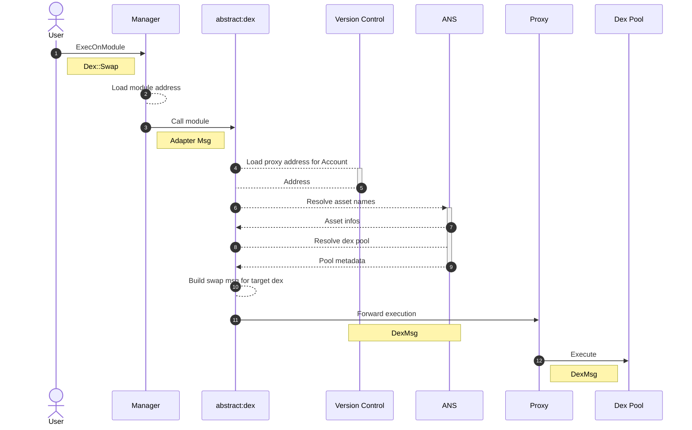
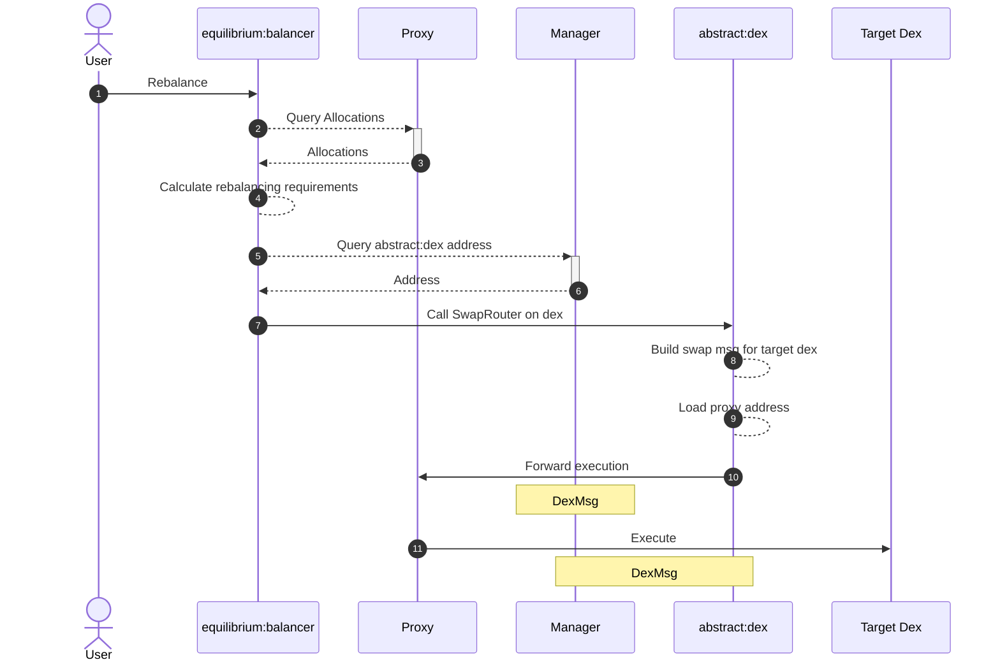

# Execute On Module

## Non-dependent Execution

## Adapter Execution
In the following example, the `abstract:dex` module is installed on an Account, and the user requests a swap on a dex. 

## Module-dependent Execution
In this example, we use [Equilibrium](../use_cases/equilibrium)'s `Rebalance` function as an example. Modules with dependencies (`equilibrium:balancer` is dependent on `abstract:etf` and `abstract:dex`) have their addresses dynamically resolved when called. 

