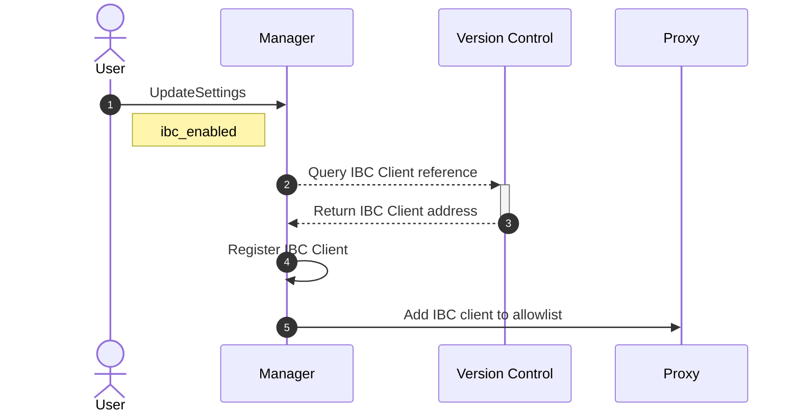

# Update Settings 
## Enable IBC
Enabling the IBC functionality of your account will register the IBC client to your account, enabling your modules to execute cross-chain commands.

> For disabling IBC, see [Uninstall Module](uninstall_module.md)