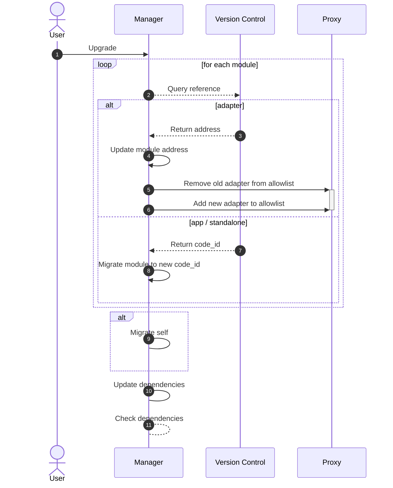

# Upgrade Modules
One of the key strengths of Abstract is that it is designed to minimize your maintenance workload while maximizing the control you have over your infrastructure.

Abstract manages module upgrades for you, ensuring your infrastructure remains intact and your workflows continue to function smoothly through every upgrade. This process is carried out in a manner that consistently maintains the integrity and security of your system.

