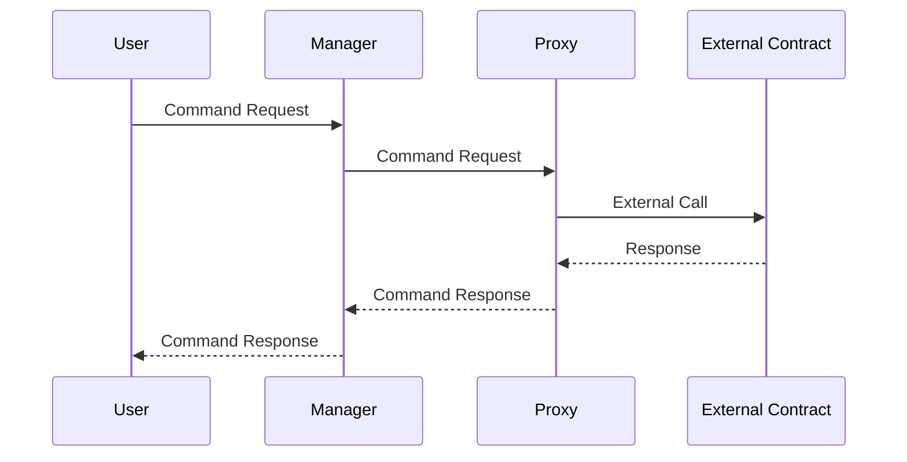

# Abstract Account Architecture

## Introduction

Abstract's architecture revolves around the powerful combination of modularity, scalability, and security in decentralized applications. At the core of this architecture is the concept of account abstraction, which forms the foundation of Abstract's functionality. For a detailed exploration of account abstraction, we recommend referring to the overview of [Account Abstraction](./account_abstraction) . In the upcoming sections, we will delve deeper into the architecture of Abstract Accounts, providing insights into its design principles and components.

Every Abstract Account is fully owned and controllable by its owner. This ensures full user soveirgnity.

## Abstract Account

The Abstract platform uses a a smart-contract account architecture with two primary components: the **Manager Contract** and the **Proxy Contract**. 

### Manager Contract

The Manager Contract serves as the orchestrator of the Abstract Account. It is responsible for various key operations, including:

-   **User Authentication**: Authenticating users and ensuring only approved entities can transact with the account.
-   **Permission Management**: Managing permissions within the account and defining the operations a user or group can perform.
-   **Interaction Control**: Regulating how the account interacts with external smart contracts and services through Abstract modules.

### Proxy Contract

The Proxy Contract serves as the protective shield of the Account, taking care of:

-   **Asset Isolation**: Separating the account's assets from direct user access, providing an added layer of security.
-   **Transaction Forwarding (Proxying)**: Routing approved transactions from the **Manager** or other modules to the network.
-   **Interaction Interface**: Acting as the primary interface for external contracts and services to interact with the Account.

### Account Interactions
The diagram below depicts the User interacting with their account through the **Manager**, and proxying a call to an external contract through the **Proxy**.

> Continue on to [Modularity in Abstract](./modules).