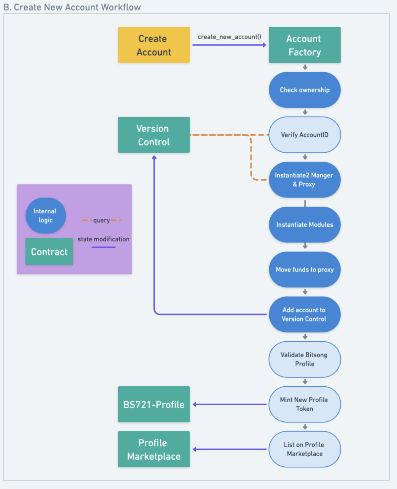
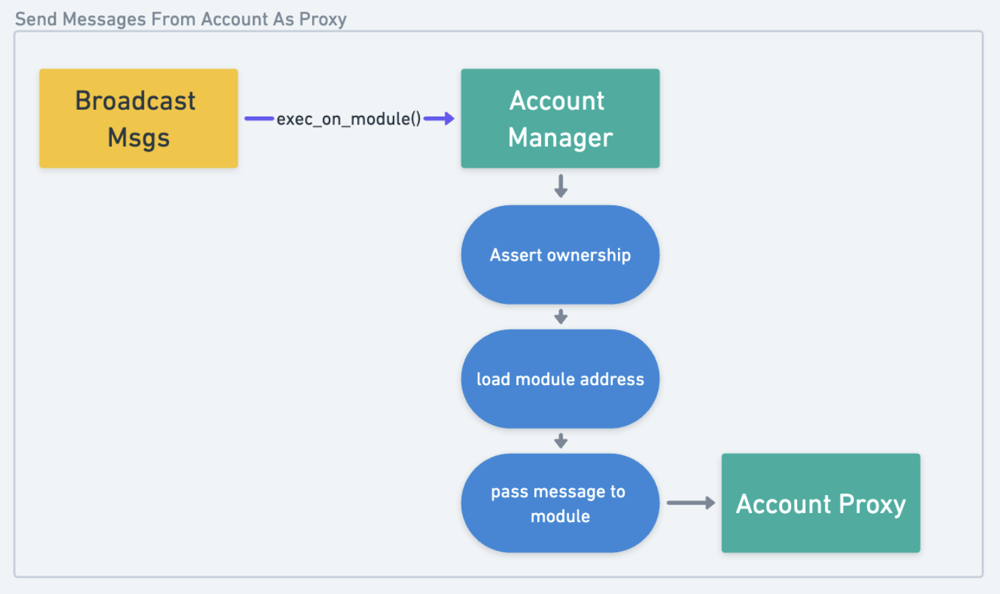
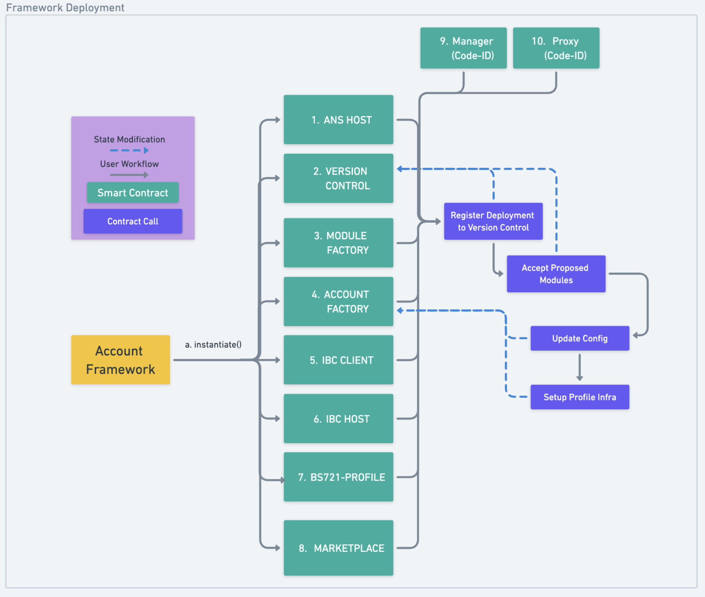

# Bitsong Profile Account Life Cycle

## Smart Contract Infrastructure

Powering the smart contract account profiles for the Bitsong ecosystem is an infused fork of two main components:
- Abstract's Account Abstraction Framework
- Stargaze's Names Contracts

## Accounts
Accounts consists of two main contracts, the manager & the proxy. Accounts can have difference governance structures:

- Monarchy: A single address is admin.
- Sub Account: Used when the account is a sub-account of another account.
- External:
- Renounced: This account no longer has an owner and cannot be used.

## Smart Contracts

### Manager 
The manager contract can be described as both a circuit board for broadcasting msgs from an account, as well as the recordkeeper of various internal states for an account. The manager contract can create sub-accounts, keeps record of proposed & installed module states,and can have its ownership transfered. This contract address is always called when sending msgs as an account. 

[Here](https://docs.abstract.money/3_framework/3_architecture.html#manager-contract) explains the modules primary functions. 

### Proxy 
 The proxy contract is the contract which functions as an internal treasury for accounts to handle native & ibc asset ownership for accounts, as well as responsible for broadcasting any messages passed to it by the account owner. The proxy contract expects a list of addresses to pass messages to run.

 [Here](https://docs.abstract.money/3_framework/3_architecture.html#proxy-contract) explains the modules primary functions. `execute_module_action` & `execute_module_action_response` are entry points that expects msgs from an internal list of registered addresses. `execute_module_action_response` is used when a response is needed to be handled calling the contract. 


### Version Control 
The version control contracts acts as an on-chain registry for all modules and accounts within an instance of a deployed framework. 
### Account Factory 
The account factory contract is used to create and manage on-chain accounts. This also serves as the escrow account for bids on ownership of accounts.

### Module Factory
The module factory contract powers installation and management of modules for accounts.
#### Modules 
Modules are smart contracts that can be installed on an Account to extend the accounts capabilities. Modules can be installed, removed, and configured by the accounts owner.

### IBC Host & Client
The IBC Host & Client are two contracts that provide IBC features for accounts.

### ANS Host
The ans-host contract handles internal state of various ibc related data, such as local ibc-channels, dexes, pools, and asset addresses. 

### Profile NFT & Marketplace 
Alongside the account contracts are the marketplace and nft collection contracts for bitsong profile tokens.

### BS721-Profile
The bs721-profile is a custom cw721-base collection for Bitsong Profiles. The owner of a profile token can be queried by its token_id, and any associated profile token can be queried for a given address.Each token has an internal `Metadata` state, which contain `TextRecords` to power additional contract verification. 

### Profile Marketplace
The profile marketplace handles can only be deployed once per contract instantiation. A marketplace contract has a configuration of:
- `trading_fee_percent` a global % for trades
- `min_price` of profile names
- `ask_interval` timeout buffer on bids
- `factory` address of account factory to serve as profile minter 
- `collection` address of profile collection deployment

An owner of a profile token may accept bids made by others on their profile token. Bids are made by sending tokens to escrow via the marketplace contract, and are kept track by the bidder address. 

## Modifications
Below describes the modifications made to the contracts.

## [Account Factory](./contracts/native/account-factory)

### Creation of an Account

There is now an optional string value `bs_profile` provided when creating an account or even a sub account. A profile token is sent to the account proxy address when minted, and are in full control of each account owner. The profile token name must be compatible with the same rules as Internet Domain Names. If there are fees required, they are validated during this contract call, and then a new profile nft is minted if the profile name as the token-id does not already exist. The proxy address is set as the owner for the marketplace contract.

### Selling Ownership of an Account 
If an owner of an account that has a profile wishes to sell ownership of their account, they may do so by accepting any bids that exists in the marketplace contract. Once a bid is accepted, the marketplace is updated as the owner of the account, to which the bidder can claim ownership of the account.


### Sending Messages as an Account

#### Default Method

The default workflow for sending messages as an account involves the account manager exec_on_module passing the msgs via `exec_on_module` to the proxy contract entry point called. 

**The manager module can pass a vector of base64 encoded stargate json messages**

### IBC


# Full Framework Deployment Directions

These directions compliment [abstract deployment scripts](../interchain/scripts/README.md) in order to deploy the custom contract versions for bitsongs specifications. 

## Option 1: Bash Scripts
You will need to have intalled & configured a network client binary `bitsongd` prior to running these bash scripts

## 1.Full Deployment
These scripts:
-  uploads compiled contracts
-  instantiates framework 
-  configures framework to default format 

to compile:
```sh 
sh scripts/build_release.sh
```

to upload:
```sh
sh scripts/upload.sh
```
make sure you record down the code-id of each contract!

to deploy, make sure you populate the correct code_ids
```sh 
sh scripts/create_deployment.sh
```

## Option 2: Abstract Client
The Abstract Client provides us will a full integration deployment script, run with cargo. To deploy to bitsong:
```sh 
# todo!()
```