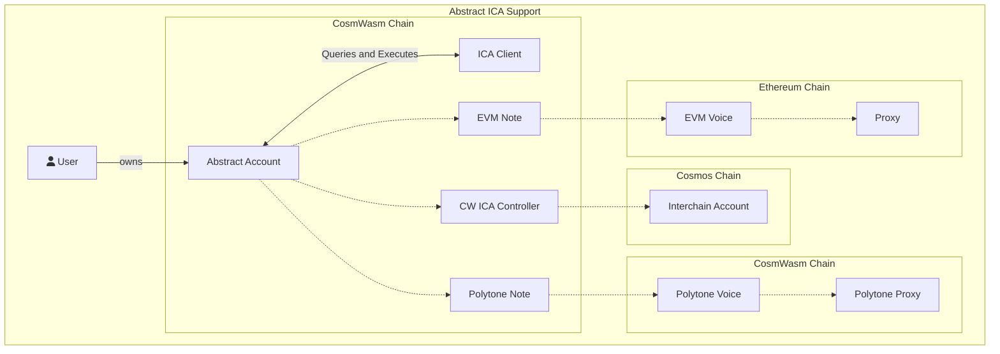

# Abstract ICA Client

The ICA client contract provides an interface for interacting with Interchain Accounts (ICAs) on different blockchains using the IBC protocol.

```mermaid
flowchart 
    subgraph Abstract ICA Support
        direction LR
        subgraph CosmWasm Chain
            PV[Polytone Voice]
            PP[Polytone Proxy]
        end

        subgraph Cosmos Chain
            A5[Interchain Account]
        end

        subgraph Ethereum Chain
            A6[Proxy]
            EV[EVM Voice]
            EV -.-> A6
        end

        subgraph CosmWasm Chain
        direction TB
        ICAC[ICA Client]
        A3 <-- Queries and Executes --> ICAC
        A3 -.-> PN[Polytone Note]
        A3 -.-> EN[EVM Note]
        A3 -.-> CI[CW ICA Controller]
        end

        User2[fa:fa-user User] -- owns --> A3["Abstract Account"]
        CI -.-> A5
        PN -.-> PV
        PV -.-> PP
        EN -.-> EV
    end
```
