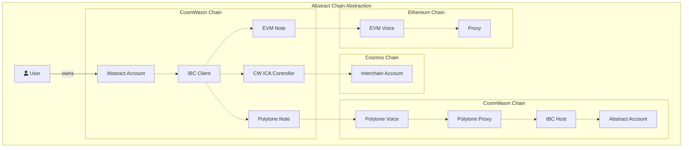

# Abstract IBC Client

The IBC client contract provides a way for Abstract Accounts to create Interchain Abstract Accounts (ICAA) on other chains. It relies on <a href="https://doc.rust-lang.org/book/" target="_blank"> Polytone</a> for IBC message forwarding.

Users can enable IBC by calling the `ManagerExecuteMsg::UpdateSettings { enable_ibc: true }` on their account's manager. This will register the `abstract:ibc_client` with the account so it can be referenced by other applications.

You can learn more about Abstract IBC [in our docs](https://docs.abstract.money/3_framework/8_ibc.html)!

