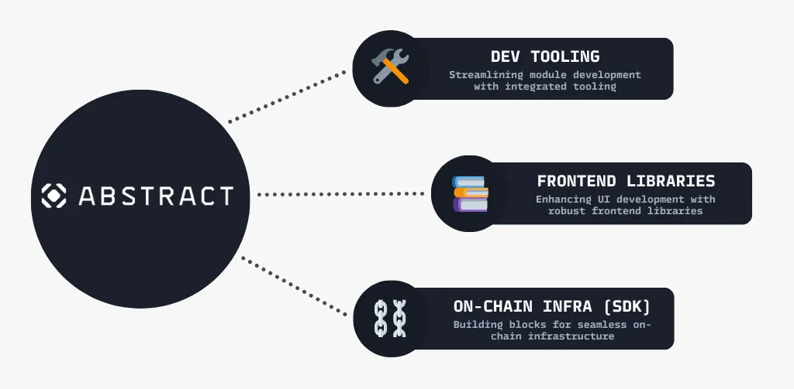

<!-- # The Abstract Development Platform -->
<!-- This page is a high-level overview of the Abstract Platform, not the SDK or any of our actual products. Hence we should stick to a vocabulary that is familiar to the reader. -->

<!-- 

### Welcome to Abstract, the interchain CosmWasm development platform.  We are building tools and infrastructure for composable smart-contract applications. 

 -->

# Abstract Documentation

Hi and welcome to Abstract, the interchain CosmWasm development platform! Abstract's CosmWasm framework is your gateway
to taking amazing ideas from concept to reality. Whether you're a coding genius or just getting started, Abstract has
got your back! By building composable modules you'll be crafting scalable masterpieces in no time.

## Abstract in a nutshell

Abstract is a CosmWasm development platform designed to simplify the creation of secure and powerful blockchain
applications. It offers a modular architecture and a suite of tools that streamline the development process, making it
easier for developers to innovate in the blockchain domain.

### Abstract Products

- **CW-Orchestrator**: A scripting tool crafted to simplify interactions with CosmWasm smart contracts. It offers macros that
  generate type-safe interfaces, promoting code readability, and reducing testing and deployment overhead.

- **Abstract JS**: A comprehensive JavaScript library designed for easy integration with on-chain Abstract functions. It
  caters to both developers aiming to embed blockchain functionalities in their apps and enthusiasts exploring the
  Abstract framework.

- **Abstract App Template**: A foundational template for developing apps within the Abstract framework. It provides the
essentials for building and integrating new Abstract Apps, facilitating both frontend and smart contract templates.

- **Abstract Testing**: A testing utility within the Abstract framework. It focuses on providing mock data creation, querying,
and robust unit testing functionalities to ensure the correctness of the framework's components.

These products collectively support developers in building, testing, and deploying CosmWasm-based applications with
enhanced efficiency and security.

## How to navigate the docs

You can read the documentation in the order it is presented, or you can jump to the section that interests you the most!
We also have a section with code tutorials that will help you get started with the Abstract SDK if you are more of a
hands-on.

Here are some useful links to get you started:

- [Abstract Overview, Core Features and Platform Essentials](./1_abstract_platform_overview.md)
- [Abstract SDK](./3_framework/1_abstract_sdk.md)
- [Build with Abstract](./4_get_started/1_index.md)
- [Abstract Platform](./5_platform/index.md)
- [Abstract Products](./1_products/index.md)
- [Use Cases](./7_use_cases/index.md)
- [Monetization on Abstract](./5_platform/6_monetization.md)
- [Glossary](./9_glossary.md)

## Use Cases

How can you use Abstract? The limit is your imagination, we can't wait to see what you build! Here are some ideas to get
you started:

- Yield farming platforms
- Decentralized exchanges
- Lending protocols
- Prediction markets
- NFT marketplaces
- Cross-chain bridges
- Supply chain managements
- Insurance and underwriting
- DAOs
- Interchain protocols
- And more!

See how others are using Abstract in the [Use Cases](./7_use_cases/index.md) section.

## Help and Support

If you feel lost or have any doubts along the way, please reach out to us! We are here to help you!

<ul>
    <li><a href="https://discord.com/invite/uch3Tq3aym" target="_blank">Discord</a></li>
    <li><a href="https://x.com/AbstractSDK" target="_blank">X</a></li>
</ul>

## Want to make Abstract better?

We are always looking for ways to improve Abstract and welcome everybody to contribute to the project. Look at the
[Contributing & Community](./contributing.md) section if you want to get involved.

## Links

<ul>
    <li><a href="https://abstract.money/" target="_blank">Website</a></li>
    <li><a href="https://github.com/AbstractSDK" target="_blank">Github</a></li>
    <li><a href="https://medium.com/@abstractmoney" target="_blank">Medium</a></li>
    <li><a href="https://docs.abstract.money/" target="_blank">Docs</a></li>
    <li><a href="https://app.abstract.money" target="_blank">Account Console</a></li>
    <li><a href="https://api.abstract.money/" target="_blank">Graphql API Explorer</a></li>
</ul>