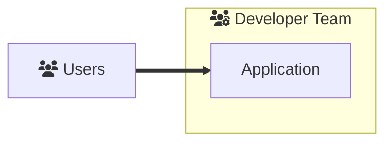
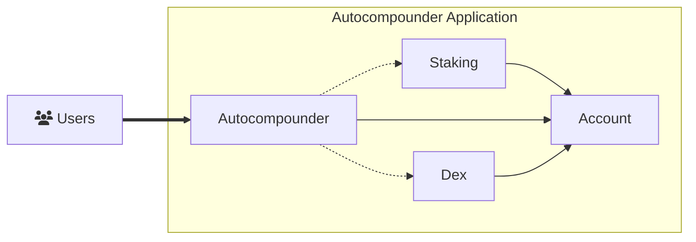
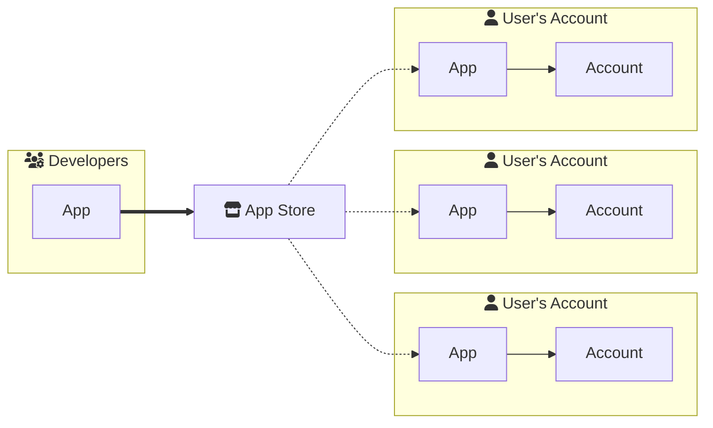
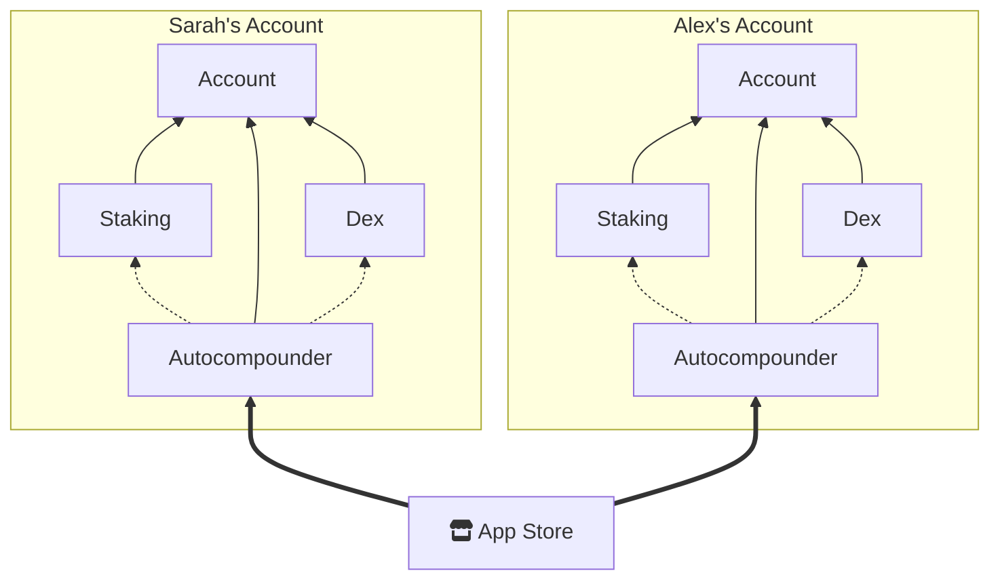

# The Abstract App Design Space

The [Abstract SDK](../3_framework/1_abstract_sdk.md) broadens your design space beyond traditional smart contract application architectures. While
applications built with standalone smart contracts can also be crafted using the SDK, the Abstract SDK promotes a level
of code reusability that goes beyond stand-alone smart contract development. It is through this code reusability that
novel applications can be constructed with little effort in a short time.

## Design Spaces Explained

### Traditional: Hosted Applications

Traditionally applications have been created by composing "stand-alone" smart contracts. With each smart contract
designed to fulfill a different role in the application's logic. We call these applications __hosted applications__
since they're deployed and controlled by the code maintainers, and to use them, users transfer funds to the
application's smart contract. Dexes, lending markets, yield aggregators are all examples of hosted applications.



#### Building a Hosted Auto-Compounder

Hosted applications can be built more efficiently with the Abstract SDK because of it's modular design. As an example,
let's consider an auto-compounder application. The auto-compounder provides liquidity to DEX trading pairs and
re-invests the received rewards into the pairs. The application's logic can be split into three modules:

- __DEX Adapter:__ Provides an interface to perform DEX operations. (e.g., swap tokens, provide liquidity, etc.)
- __Staking Adapter:__ Provides an interface to perform staking operations. (e.g., claim rewards, stake, unstake, etc.)
- __Auto-Compounder:__ Orchestrates the DEX and staking adapters to perform the auto-compounding logic.

If we visualize this application, we can see that the DEX and staking adapters are reusable components that can be used
in other applications. The auto-compounder, in this approach, is a unique application that can be installed on an
account and used by users to deposit into and withdraw from the auto-compounder application. The account essentially
acts as a vault that holds all the users' funds.



This approach offers two significant benefits:

- __Code Reusability:__ Developers can reuse the DEX and staking adapters in other applications. Furthermore, *Abstract
  already provides a library of adapters for the most popular protocols.* This saves you both time and money as you
  don't need to write the integrations yourself.
- __Security:__ The auto-compounder application's logic is reduced to it's bare minimum, making it easier to audit and
  maintain. Furthermore, the DEX and staking adapters are battle-tested smart contracts, which further reduces the
  attack surface.

### Innovative: Self-Hosted (MyFi) Applications

```admonish info
Read [our blogpost on Abstract MyFi](https://medium.com/abstract-money/abstract-introduces-myfi-a-case-study-cff2bc0e2e4d) for a less technical overview.
```

MyFi, short for My Finance, is a novel concept for "self-hosted applications" only achievable with Abstract's unique application architecture.
 Here, __users own their applications__ and don't need to transfer funds to the application's smart contract. Instead, they
deploy the smart contract to their account, which grants the application rights to access those funds. Each application
is a new instantiation of a smart contract that is owned and configurable by the user. The user can thus update the
application's code, parameters, and permissions at any time, without relying on the application's maintainers.



This approach offers two significant benefits:

- __Sovereignty:__ Users have more control over their funds as they don't need to trust application maintainers.
- __Customizability:__ Users can tailor their application, leading to novel customization options unavailable with
  hosted applications.

Let's see how this applies to the auto-compounder application from before:

#### Building a Self-Hosted Auto-Compounder

The auto-compounder application can easily be converted into a self-hosted application. Again, by self-hosted we mean
that instead of users moving their funds to an externally owned account, they deploy the auto-compounder application to
their own account. The auto-compounder application is now owned by the user and can be configured to their liking.



With this setup Alex and Sarah can both use the auto-compounder application, but they can configure it to their liking.
For example, Alex can configure the auto-compounder to compound his rewards every 24 hours, while Sarah can configure
the auto-compounder to compound her rewards every 12 hours. This approach allows for a very customizable and
personalized experience.
