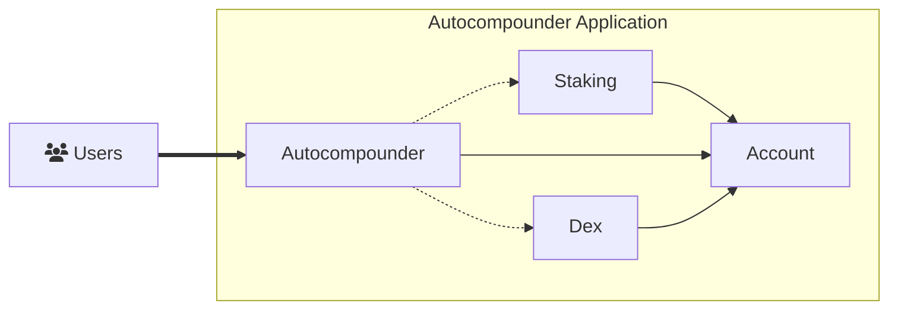

# Abstract SDK

The attentive reader will already know that the Abstract SDK is a Rust library that is tightly integrated with Abstract's on-chain infrastructure. More importantly though, the Abstract SDK is a tool that allows developers to easily perform accounting-based operations and interactions with other smart contracts within their own module.

From a high-level perspective, modules built with the Abstract SDK can use on-chain dependencies (other modules) to isolate specific functionalities. In this way, a module built with the Abstract SDK can explicitly define its dependencies and use them to perform complex multi-contract interactions with very minimal code. This, in turn, allows you to focus on the novel functionality of your application without inheriting the complexity of the underlying infrastructure.

<!-- ## Why build with Abstract?

The Abstract SDK is designed to solve the following problems:

- **Simplified Development** ♻️: CosmWasm development has been a start-from-scratch process up until now. Abstract
  simplifies the development process by providing a modular architecture and a
  comprehensive set of tools both for the **frontend and backend**, allowing you to reuse components across multiple
  dApps reducing development time, increasing productivity, iteration speed and shortening the go-to-market of your
  ideas.

- **Security** 🔐: The Abstract SDK is built on top of the CosmWasm smart-contract framework, which is a battle-tested
  and
  highly secure platform. Because of its modular design, it's also easier to audit and test. Audited components can be
  reused across multiple dApps, reducing the risk of bugs and vulnerabilities. Building with the Abstract SDK
  automatically makes it more secure, with an "off-by-default"permission system, fully configurable by you.

- **Complexity** 🧠: The Abstract SDK simplifies the development process by providing a modular framework that allows
  you to focus on the core functionality of your dApp.

- **Compatibility** 🔄: The Abstract SDK is designed to work seamlessly with popular on-chain services in the Cosmos
  ecosystem, decentralized exchanges, money markets, oracles, etc.

- **Interoperability** 🌐: The Abstract SDK is chain-agnostic, allowing you to build dApps that can interact with
  multiple blockchains within the Cosmos ecosystem.

- **Scalability** 📈: The Abstract SDK is designed to scale with your needs, allowing you to easily deploy
  to new networks, iterate on your product and achieve product market fit. Through its novel on-chain application store
  it also allows for personalized dApps that can be customized by the developers to meet their specific needs, making
  the Abstract SDK the first decentralized software distribution platform.

- **Continuous Funding** 📈: Developers on the Abstract platform can earn ongoing revenue for their contributions by
  leveraging the platform's
  community-driven incentives. As a developer you can publish your smart contract modules on the marketplace and receive
  proceeds directly from sales to other teams via subscription or one-time fee. Read more about monetization on the
  Abstract platform [here](../5_platform/6_monetization.md)

- **Continuous Innovation and Collaboration** 👥: The Abstract SDK enables you to collaborate on the creation of dApps
  through its composable
  architecture and its ability to easily publish testing infrastructure for mock environment construction.

- **Developer-Centric Approach** 👥: Abstract is built by developers for developers. We understand the challenges and
  complexities that developers
  face in the blockchain space, and we're committed to providing the necessary tools, resources, and support to make
  your
  journey smooth and rewarding. Whether you're an experienced blockchain developer or new to the space, Abstract is
  designed to empower you and unlock your full potential.

In essence, the Abstract SDK offers a structured yet flexible approach to smart-contract development, promoting
reusability and efficiency. With its robust technical capabilities, streamlined development process, rock-solid security
infrastructure, and
effortless integration with financial services, Abstract empowers developers to unleash their creativity, craft
cutting-edge financial applications, and make valuable contributions to the flourishing Cosmos ecosystem. -->

## SDK Features

At the heart of the Abstract SDK are "features" - Rust traits that can be seen as building blocks you can combine in various ways. Each feature provides a specific capability or function. By composing these features it is possible to write advanced APIs that are automatically implemented on objects that support its required features.

## APIs

Abstract APIs are Rust structs that can be constructed from within a module if that module implements a set of features. Most of these features will already be implemented by us, so don't have to worry about their implementation.

These retrievable API objects then exposes functions that simplify module development.

For example, the `Bank` API allows developers to transfer assets from and to an address. The `Bank` API can be constructed and used as follows:

```rust,ignore
// Construct the Bank API
let bank: Bank = app.bank(deps.as_ref());
// Do a transfer
let transfer_action: AccountAction = bank.transfer(vec![asset.clone()], recipient)?;
```

> **Note:** The `Bank` API is just one of the many APIs that are available in the Abstract SDK. You can find a list of all available APIs (and how to build one yourself) in the [`abstract-sdk` Rust docs](https://docs.rs/abstract-sdk/latest/abstract_sdk/) section.

We'll dive deeper into the Abstract SDK's APIs in the [Build With Abstract](../4_get_started/1_index.md) section.

## Module Bases

Our module bases are generic CosmWasm contract implementations that:

- Have some state and functionality already implemented.
- Can be extended and composed by appending your custom logic to them.

Think of each of these bases as a foundation for building your application using the Abstract SDK. There are different types of bases available, each tailored for specific needs and functionalities.

- <a href="https://crates.io/crates/abstract-app" target="_blank">App</a>
- <a href="https://crates.io/crates/abstract-adapter" target="_blank">Adapter</a>

We will go into the technical details of these bases and their differences in the [Build With Abstract](../4_get_started/1_index.md)
section.

## Example: Autocompounder

Let's take a look at what an `Autocompounder` app built with the Abstract SDK would look like. This `Autocompounder` has a dependency on two adapters, a `Dex` and `Staking` adapter. Drawing out the architecture would result in something like this:



```admonish reminder
The `Account` is a set of smart-contracts that function as smart-contract wallet infrastructure. It holds the application's funds. We covered the `Account` architecture in detail [here](3_architecture.md).
```

Each solid arrow represents permissions to perform actions on behalf of the account. These permissions allow the contracts to move funds, interact with other contracts through the account, and perform other actions. It does this by sending messages to the account, which then executes them on behalf of the module. This is the basic idea behind account abstraction and is further elaborated in on the [account abstraction](./2_account_abstraction.md) page. Now, let's focus on the dotted arrows.

Each dotted arrow indicates a dependency between modules. These dependencies are explicitly defined in the module that takes on the dependencies and are asserted when the module is installed. In this example the Autocompounder module is able to access special functionality (like swapping or staking assets) from its dependencies (the dex and staking adapters). Through this mechanism, a major reduction in the application's amount of code and complexity is achieved.

From a developer ecosystem standpoint, this modular approach encourages collaboration and cross-team code re-use, a practice that has been proven to accelerate development and increase developers' productivity.
