# Abstract SDK

At the heart of the Abstract development platform lies the Abstract SDK, a modular smart-contract framework intended to
streamline and expedite the creation of CosmWasm dApps. It achieves this by emphasizing reusability and composability
via an account-abstraction oriented architecture. The SDK is constructed atop the
battle-tested <a href="https://cosmwasm.com/" target="_blank">CosmWasm</a>: a
WASM-based smart-contract framework developed in <a href="https://www.rust-lang.org/">Rust</a>.

From a high-level perspective, smart-contracts built with the Abstract SDK can use on-chain dependencies (other
smart-contracts) to isolate specific functionalities. In this way, a smart-contract built with the Abstract SDK can
explicitly define its dependencies and use them to perform complex multi-contract interactions with very minimal code.
This, in turn, allows you to focus on the novel functionality of your application without inheriting the complexity of
the underlying infrastructure.

## What Problem Does it Solve?

The Abstract SDK is designed to solve the following problems:

- **Reusability** ♻️: CosmWasm development has been a start-from-scratch process up until now. The Abstract SDK allows
  you to reuse components across multiple dApps, reducing development time, increasing productivity, iteration
  speed and shortening the go-to-market of your ideas.

- **Security** 🔐: The Abstract SDK is built on top of the CosmWasm smart-contract framework, which is a battle-tested
  and
  highly secure platform. Because of its modular design, it's also easier to audit and test. Audited components can be
  reused across multiple dApps, reducing the risk of bugs and vulnerabilities.

- **Complexity** 🧠: The Abstract SDK simplifies the development process by providing a modular framework that allows
  you to focus on the core functionality of your dApp.

- **Compatibility** 🔄: The Abstract SDK is designed to work seamlessly with popular on-chain services in the Cosmos
  ecosystem, decentralized exchanges, money markets, oracles, etc.

- **Interoperability** 🌐: The Abstract SDK is chain-agnostic, allowing you to build dApps that can interact with
  multiple blockchains within the Cosmos ecosystem.

- **Scalability** 📈: The Abstract SDK is designed to scale with your needs, allowing you to easily deploy
  to new networks, iterate on your product and achieve product market fit. Through its novel on-chain application store
  it also allows for personalized dApps that can be customized by the developers to meet their specific needs, making
  the
  Abstract SDK the first decentralized software distribution platform.

- **Collaboration** 👥: The Abstract SDK enables you to collaborate on the creation of dApps its composable
  architecture and the ability to easily publish testing infrastructure for mock environment construction.

In essence, the Abstract SDK offers a structured yet flexible approach to smart-contract development, promoting
reusability and efficiency.

## Key Components

The Abstract SDK comprises the following key concepts:

### Features

At the heart of the Abstract SDK are "features" - Rust traits that can be seen as building blocks you can combine in
various ways. Each feature provides a specific capability or function. By composing these features it is possible to
write advanced APIs that are automatically implemented on objects that support its required features.

### Abstract APIs

The Abstract APIs are objects that can only be retrieved if a contract or feature-object implements the required
features/api traits. If the trait constraints for the Adapter is met it is automatically implemented on the object and
allows you to retrieve the Adapter object.

### Abstract Base

Think of this as the foundation or starting point for building applications using the Abstract SDK. There are different
types of bases available, each tailored for specific needs and functionalities.

There are three kinds of bases:

- [App]((https://crates.io/crates/abstract-app){target="_blank"})
- [Adapter]((https://crates.io/crates/abstract-adapter){target="_blank"})
- [IBC-host]((https://crates.io/crates/abstract-ibc-host){target="_blank"})

We will go into the technical details of these elements on the [Build With Abstract]() section.

## Example: Autocompounder

Let's take a look at how an `Autocompounder` app built with the Abstract SDK would look like. This `Autocompounder` has
a dependency on two contracts, a `Dex` and `Staking` contract. The dependency tree would look like this:

```mermaid
flowchart LR
    subgraph Autocompounder Application
        direction BT
        Autocompounder -.-> Dex
        Autocompounder -.-> Staking
        Staking --> Account
        Autocompounder --> Account
        Dex --> Account
    end

    User[fa:fa-users Users] ==> Autocompounder

    style User fill: #161b25
    style Autocompounder fill: #161b25
    style Staking fill: #161b25
    style Dex fill: #161b25
    style Account fill: #161b25
```

Remember we said the Abstract SDK uses account-abstraction?

Each solid-line arrow represents execution permissions of the autocompounder contract on the account. These permissions
allow the autocompounder contract to move funds, interact with other contracts through the account, and perform other
actions. It does this by sending messages to the account, which then executes them on behalf of the autocompounder
contract. This is the basic idea behind account abstraction and is further elaborated in on
the [account abstraction](./3_account_abstraction.md) page.

Each dotted arrow indicates a dependency between the contracts. These dependencies are explicitly defined in the
autocompounder contract and are asserted at contract instantiation. In this example the autocompounder contract is able
to access
specific functionality (like swapping or staking assets) from its dependencies (the dex and staking contract). Through
this mechanism, a major reduction in the amount of code and its complexity is achieved, as otherwise every dex or yield
provider would have to be integrated with the autocompounder contract itself.

From a developer ecosystem standpoint, the modularity provided by the Abstract SDK encourages collaboration and
cross-team code re-use, a practice that has been proven to accelerate development and increase developers' productivity.
As the saying goes, *a rising tide lifts all boats.*

