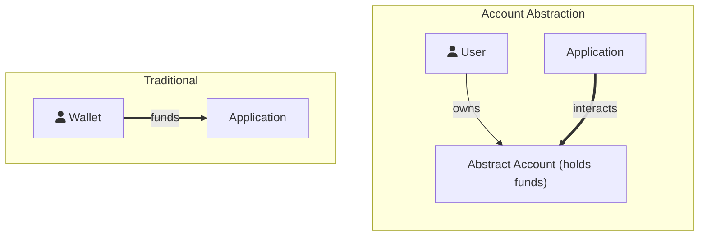

# Account Abstraction

Abstract uses Account Abstraction as a conceptual framework for building smart-contract applications. Our central idea is that, instead of building a monolithic smart-contract that users interact with, you let the smart-contract interact with a user-owned smart-contract wallet instead. Let's dive a bit deeper into this concept and how it applies to Abstract's own Abstract Accounts.

## What is Account Abstraction?

In traditional blockchain interactions, a transaction is typically initiated by a user signing some data with their private key and transmitting that data (and its signature) to an endpoint for validation. Account abstraction modifies this process by making the transaction initiation and validation programmable. Essentially, it allows the transaction logic to be customized within a smart-contract, vastly extending the scope of UX possibilities.

The Abstract SDK provides what we call an **Abstract Account**, an extensible smart-contract wallet capable of holding tokens and interacting with other smart contracts. The ownership structure of an Abstract Account is customizable to fit your use-case.



As displayed in the figure above, the Abstract Account (AA) is a smart contract wallet that is owned by the user. User action validation on the account is currently still performed through regular transaction authorization (wallet-based) but can be customized in the future to allow for OAuth login or other types of login methods.

The purpose of the Account is to hold funds for the user. Now if the user wants to interact with an application, they give the application permission to interact with the Abstract Account, and its funds. This way the user never gives the application custody over his/her funds.

```admonish info
See <a href="https://eips.ethereum.org/EIPS/eip-4337" target="_blank">EIP-4337</a> to read about account abstraction in the Ethereum ecosystem.
```

In the next section we'll dig into the architecture of Abstract Accounts.

<!-- This concept of account abstraction can provide numerous benefits:

- **Improved User Experience**: Users can interact with smart contracts more seamlessly, without worrying about the
  underlying blockchain complexities. The verification model can be tailored to feel like familiar web2 experiences.

- **Enhanced Security**: By shifting validation logic to smart contracts, a variety of security checks can be
  implemented to guard against unauthorized transactions. This could include multi-factor authentication, whitelisting,
  and more.

- **Reliable Fee Payment**: Account abstraction can enable smart contracts to pay for gas, thereby relieving end-users
  from managing volatile gas prices or even paying for gas at all.

In the following sections, we'll discuss how Abstract utilizes the concept of account abstraction, ensuring modularity,
security, and scalability in applications built using the Abstract SDK. -->

<!-- ## Abstract Apps

Abstract Apps are smart-contracts that add functionality to an Abstract Account. Here's a small snippet of code to give
you an idea of how an App is created with the Abstract SDK:

```rust,no_run
{{#include ../../../packages/abstract-app/examples/counter.rs:handlers}}
```

The code above defines an **Abstract App**. This app can be installed on any Abstract Account through
the <a href="https://console.abstract.money" target="_blank">Abstract App
store</a>, allowing developers to monetize their code.

The customizable handlers that are used in the builder are functions similar to the native CosmWasm entry-point
functions. They expose an additional App object which, via the `abstract-sdk`, empowers you to execute intricate
multi-contract transactions with minimum code. Importantly, this simplification does not limit the contract's
programmability. Instead, it provides a balance of efficient coding and comprehensive control over inter-contract
interactions.

In the upcoming section we will explore the [architecture of Abstract Accounts](3_architecture.md), providing insights
into its design. -->