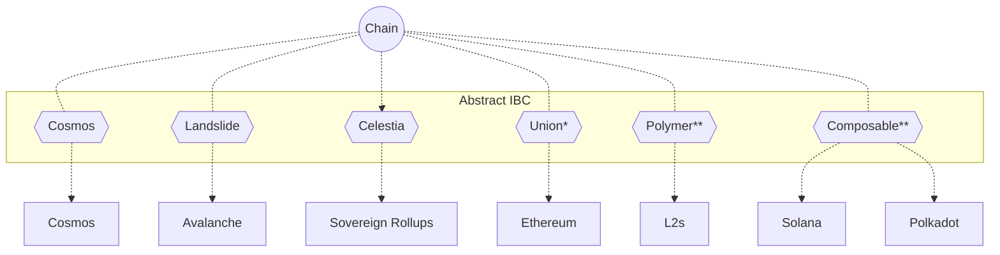
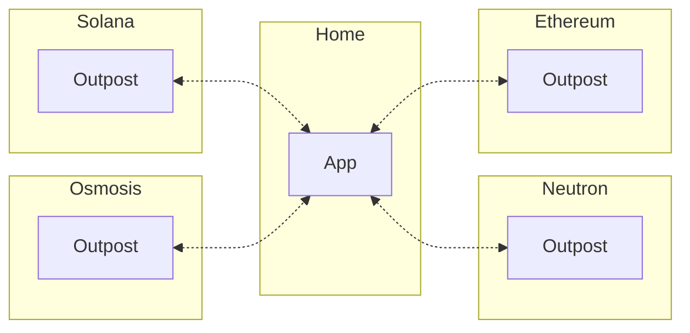

# Chain Abstraction

We believe that **abstraction is key to adoption** because users care about the experience, not the technology. Abstract enables chain abstraction for chains, protocols, and applications.

## What is Chain Abstraction?

```admonish info
Watch [our talk on chain abstraction](https://www.youtube.com/watch?v=5biJAkm3FoA) to hear how Abstract solves the fragmentation presented by the appchain thesis.
```

The number of chains has been increasing exponentially year-by-year as blockchain technology evolves. While this offers more capabilities to application developers, it also makes the user experience significantly more fragmented as their accounts, liquidity, and applications are spread across multiple chains.

Put simply, chain abstraction removes the need to be aware of the active chain when interacting with an application. It "abstracts" the chain away, allowing the user to focus on the application in use.

## Abstract chain abstraction

Abstract enables chain abstraction via [Interchain Abstract Accounts (ICAAs)](../3_framework/8_ibc.md). These ICAAs allow accounts on one chain to control accounts on any other chain connected via IBC via Abstract's proprietary IBC protocol.

```admonish info
Experience chain abstraction yourself by minting an NFT on Neutron directly from XION [here](https://xion.abstract.money)! This demonstration walks you through each step of the process, though all actions can be fully abstracted away in practice.
```

### For Chains

Chains using Abstract can offer users access to apps, accounts, and yield opportunities on any chain connected via IBC. To deliver maximum value to your users, your chain must support the [CosmWasm VM](https://cosmwasm.com) to used as an Abstract controller chain If your chain is already IBC-enabled, it is Abstract-enabled and available to Abstract controller chains.

#### Benefits

- Interoperability with the interchain ecosystem
- Cross-chain yield availability
- Increased Total Value Controlled (TVC) by your chain
- Increased transaction volume
- Better cross-chain user experience



### For Protocols

ICAAs give protocols cross-chain superpowers. Common use cases include:

#### Cross-chain Outposts

Outposts give users on other chains access to your application without having to transact on your application's home chain. This extends the reach of your app and offers smoother UX.



#### Cross-chain DeFi Strategies

Complex DeFi strategies can be written using a combination of ICAAs and [Abstract DeFi Adapters](../modules/defi-adapters.md). For example, borrowing an asset on Kujira GHOST, and lending it on Neutron Mars to capture yield.


### For Users

Any user with an [Abstract Account](../3_framework/3_architecture.md) is able to leverage our chain abstraction capabilities on Abstract-enabled chains. When a user makes a transaction using Abstract, technical aspects such as gas, bridging, and cross-chain interactions are performed behind the scenes, making their experience as smooth as possible.


## Performance

ICAAs offer significantly higher performance and transaction throughput than the [Interchain Account IBC Standard](https://github.com/cosmos/ibc/blob/main/spec/app/ics-027-interchain-accounts/README.md). In a case study with [XION](../7_use_cases/xion.md), we saw over a 10x increase in account creation and transaction bandwidth. With this being said, we also support traditional ICAs within our platform, though this is currently in an alpha stage. Please [contact us](../11_contact.md) to learn more.
