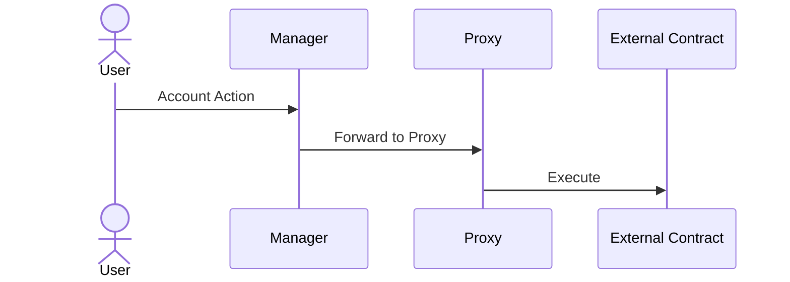
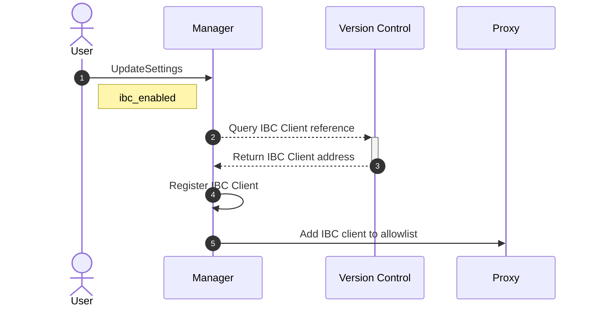

# Abstract Account Architecture

## Introduction

Abstract's account architecture is skillfully designed, merging modularity, scalability, and security. This
architectural design is anchored by the ideas of account abstraction. For a detailed exploration of account abstraction,
read [the preceding chapter](./2_account_abstraction.md). In the upcoming sections, we will delve deeper into the
architecture of Abstract Accounts, providing insights into its design principles and components.

## Abstract Account

The Abstract SDK provides users with a sovereign *smart-contract wallet*. We call this smart-contract wallet
an `Abstract Account`. The account's architecture has two primary components (smart-contracts): the **Manager** contract
and the **Proxy** contract.

```mermaid
flowchart LR
    subgraph Abstr[Abstract Account]
        direction TB
        Manager --> Proxy
    end

    Owner -.-> Manager

    style Owner fill: #161b25
    style Manager fill: #161b25
    style Proxy fill: #161b25
```



The *owner* of the account, can configure the Abstract account by sending messages to the manager contract. We don't
make any assumptions about the nature of this owner, it can be a wallet, multi-sig or any other ownership structure,
allowing you
to customize your Abstract account's ownership to fit your needs.

```admonish info
You can read up on the different ownership structures in our [Ownership](./5_ownership.md) section.
```

The account's architecture centers around **configurable programmability**. In other words, how can one configure the
account (install applications, set permissions, etc.) to enable users and developers to easily customize it to do what
they want?

Let's dive deeper into the two components of the Abstract Account.

### Manager Contract

The *Manager* is responsible for the account's configuration and security, serving as the controller of the Abstract
Account. It is responsible for various important operations, including:

- **Owner Authentication** 🔐: Authenticating privileged calls and ensuring only approved entities can interact with the
  account.


- **Application Management** 📦: Managing and storing information about the applications installed on the account, their
  inter-dependencies, permissions and configurations.


- **Account Details** 📄: Storing the account's details, such as its name, description, and other relevant information.

### Proxy Contract

The *Proxy* is responsible for the account's programmability and assets management, serving as the asset vault of the
Abstract Account, taking care of:

- **Asset Management & Pricing** 💰: Holding the account's assets, including tokens, NFTs, and other fungible and
  non-fungible assets as well as allows for pricing assets based on decentralized exchange or oracle prices.


- **Transaction Forwarding (Proxying)** 🔀: Routing approved transactions from the **Manager** or other connected
  smart-contracts to other actors.

### Account Interactions

The diagram below depicts a User interacting with its Abstract account through the **Manager**, and proxying a call to
an
external contract through the **Proxy**.



## Enabling IBC on your Abstract Account

Enabling the IBC functionality on your Abstract Account is done via the Manager contract with the UpdateSettings
message. By doing so the IBC client will be registered to your account, enabling your modules to execute cross-chain commands.



> For disabling IBC, see [Uninstall Module](6_module_types.md#installing-and-uninstalling-modules)