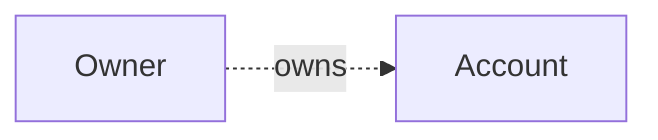
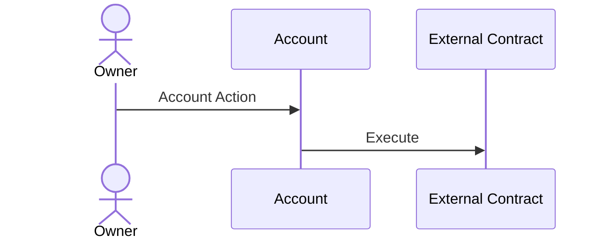

# Abstract Accounts

Abstract Accounts are programmable smart-contract wallets used as the backbone for Abstract Apps, which will be covered later. Abstract Accounts hold funds for users and/or applications while exposing a set of programmable endpoints that can be used to configure and interact with the account.

Abstract Apps use the Abstract Account on which they are installed as the settlement layer for their transactions. In other words, Abstract Apps rarely hold funds themselves. Instead they control the funds of the Account that they are installed on. This separation of concerns allows for a more secure and modular design.

In the upcoming sections, we will delve deeper into the architecture of Abstract Accounts, providing insights into its design principles and components.

## Architecture

Abstract's infrastructure provides users with the ability to create a sovereign *smart-contract wallet*. We call this smart-contract wallet
an `Abstract Account`. The account's architecture has two primary components (smart-contracts): the **Manager** contract
and the **Proxy** contract.



As shown in the image above, an *owner* of an account, can configure his Abstract Account by sending messages to the contract. We don't make any assumptions about the nature of this owner, it can be a wallet, multi-sig or any other ownership structure, allowing you to customize your ownership structure to fit your needs.

```admonish info
You can read up on the different ownership structures that we explicitly support in our [Ownership](./4_ownership.md) section.
```

The account's architecture centers around **configurable programmability**. In other words, how can one configure the account (install applications, set permissions, etc.) to enable users and developers to easily customize it to do what they want?

To do this the account needs the following components:

- **Authentication** 🔐: Authenticating privileged calls and ensuring only approved entities can interact with the account.

- **Application Management** 📦: Managing and storing information about the applications installed on the account, their inter-dependencies, permissions and configurations.

- **Account Details** 📄: Storing the account's details, such as its name, description, and other relevant information.

- **Asset Management** 💰: Holding the account's assets, including tokens, NFTs, and other fungible and non-fungible assets.

- **Transaction Forwarding (Proxying)** 🔀: Routing approved transactions from the **Manager** or other connected smart-contracts to other actors.

<details>
<summary>Example Interactions</summary>

### Perform an action on Your Abstract Account

The diagram below depicts an Owner interacting with his Abstract Account and proxying a call to an external contract.



### Enabling IBC on Your Abstract Account

Enabling the IBC functionality on your Abstract Account is done via the UpdateSettings message. By doing so the IBC client will be registered to your account, enabling your modules to execute cross-chain commands.


</details>
