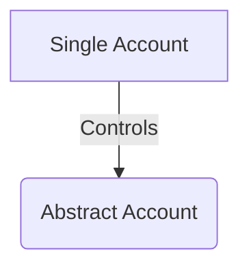
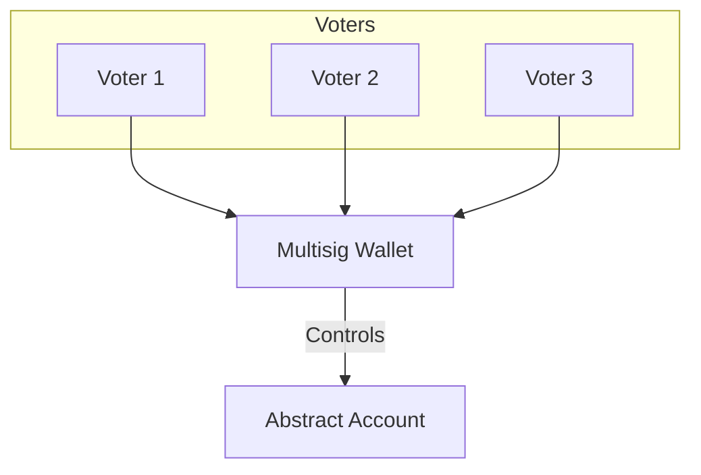
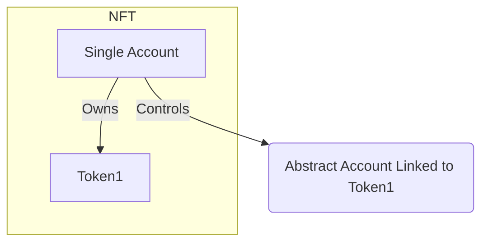
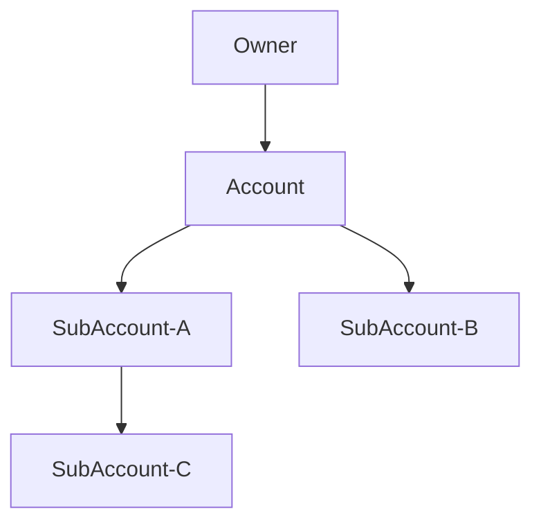
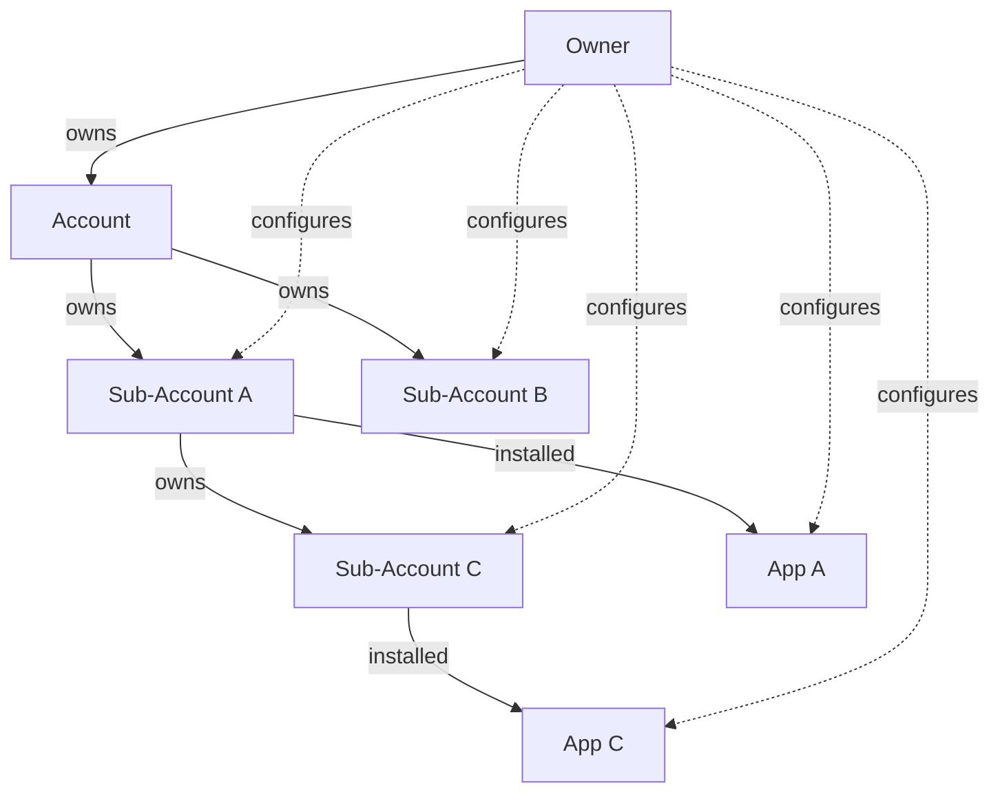

# Account Ownership

Abstract Accounts can be owned by any (custom) governance infrastructure. Because most developers appreciate an easy-to-use interface to control their Account, Abstract supports two fully integrated governance structures that ensure a seamless user experience.

When configuring the governance for your Account, you will be prompted to choose between supported governance types, *Monarchy* or *Multi-signature*.

```admonish info
Not interested in account ownership? Skip to our section on [Framework Components](../5_platform/index.md).
```

## Monarchy

In a monarchy, a single wallet has full control over the Account. If you're connected with a wallet, your address will be automatically inserted as the owner.



## Multi-signature

Multi-signature ("multisig") governance is a governance structure that requires a subset of its members to approve an action before it can be executed. Abstract implemented this functionality with the <a href="https://github.com/CosmWasm/cw-plus/blob/main/packages/cw3/README.md" target="_blank"> cw-3 standard</a>.

Here are a few terms you need to know about when configuring your multisig:

- *Voter weight* 🏋️‍♂️: The weight that the voter has when voting on a proposal.
- *Threshold* 📊: The minimal % of the total weight that needs to vote YES on a proposal for it to pass.



### Example

Suppose you share an account with your friends and want to use a multisig governance structure to prevent unilateral control over the account. You have five stakeholders, and you want at least 60% of the total voting weight to approve a proposal for it to pass.

1. Set up the multisig module in your dApp.
2. Assign voter weights to each of the five stakeholders. For instance, A: 30%, B: 20%, C: 20%, D: 15%, and E: 15%.
3. Configure the multisig module with a 60% threshold.

With this configuration, any proposal will require approval from stakeholders with a combined voting weight of at least 60% to be executed. This ensures a more democratic decision-making process and reduces the risk of a single stakeholder making unilateral decisions.

## NFT

NFT governance is a structure that represents an account which ownership depends on the ownership of an NFT. This admin of the Account is the owner of the specific token. When this token is transfered, the account ownership is transferred automatically with it.



## Xion Abstract Account

This XION Abstract Account governance leverages <a href="https://xion.burnt.com/" target="_blank" >Xion</a>'s techonology to authenticate user calls using other methods than the standard Wallet/Private/Public Key authentication. With this governance type, users are able to extend the XION base functionalities to work directly with Abstract.

You can find more details on the <a href="https://github.com/burnt-labs/abstract-account/blob/2c933a7b2a8dacc0ae5bf4344159a7d4ab080135/README.md" target="_blank">Xion Abstract Account page</a>.


## Sub-Accounts

A Sub-Account is an Abstract Account that is owned by another Abstract Account. They are important to users as they allow users to safely experiment with different apps without the concern of those apps accessing funds from their main account or other apps.

Sub-accounts are easily created by calling `CreateSubAccount` on any account. The diagram below shows how sub-accounts are owned by a main `Account` or other sub-accounts.



To simplify accessing or configuring a sub-account or app we allow calling any sub-account or any app on a sub-account directly without requiring the message to be proxied through the top-level account. The diagram below shows how an account owner can configure the sub-accounts and apps directly that are part of his main account.



This diagram illustrates:

- The Owner owns the main Account.
- The Account owns Sub-Account A and Sub-Account B.
- Sub-Account A owns Sub-Account C.
- Sub-Account A installed App A, and Sub-Account C installed App C.
- The Owner can directly configure any Sub-Account or App without needing to proxy through the main Account.

Explanation of the Diagram:

- **Ownership Relationships:** Solid arrows (`-- owns -->`) indicate ownership. The hierarchy shows how sub-accounts are nested and owned by parent accounts.
- **App Associations:** Solid arrows labeled `installed` show which apps are associated with which sub-accounts.
- **Direct Configuration:** Dashed arrows (`-. configures .->`) indicate that the owner can directly configure the sub-accounts and any of its apps.

As a result of this structure, complex multi-account systems can easily be transferred between governance systems by simply changing the owner of the top-level account.

```admonish info
Sub-accounts have a depth of 2. I.e. an account can have sub-accounts, and those sub-accounts can have sub-accounts themselves, but no further.
```
