# Account Ownership

Governance structures are a wildly under-developed field in the realm of smart contract technology. The Abstract
Platform allows for any custom governance type to be used with its chain-agnostic framework. While most developers
appreciate
an easy-to-use interface to control their dApps, Abstract opts to provide two fully integrated governance choices (
token-based and DaoDao integration coming soon) that ensure a seamless user experience.

When setting up governance for your dApp, you will be prompted to choose between supported governance types, *Monarchy*
and *Multi-signature*.

```admonish info
Not interested in account ownership? Skip to our section on [Framework Components](../5_platform/index.md).
```

## Monarchy

In a monarchy, a single wallet has full control over the dApp. If you're connected with a wallet, your address will be
automatically inserted as the root user.

```mermaid
graph TD
    A[Single Account] -->|Controls| B(Abstract Account)
    style A fill:#161b25
    style B fill:#161b25
```



## Multi-signature

Multi-signature ("multisig") governance is a governance structure that requires a subset of its members to approve an
action before it can be executed. Though multiple multisig contract implementations exist, Abstract provides this
functionality using the cw-3 standard with the goal of providing the most flexible solution to users.

Here are a few terms you need to know about when configuring your multisig:

- *Voter weight* 🏋️‍♂️: The weight that the voter has when voting on a proposal.


- *Threshold* 📊: The minimal % of the total weight that needs to vote YES on a proposal for it to pass.

```mermaid
graph TD
    subgraph Voters
        V1[Voter 1]
        V2[Voter 2]
        V3[Voter 3]
    end

    V1 --> A[Multisig Wallet]
    V2 --> A
    V3 --> A
    
    A -->|Controls| B(Abstract Account)

    B[Abstract Account]
 
    style A fill:#2c313d
    style B fill:#161b25
    style V1 fill:#161b25
    style V2 fill:#161b25
    style V3 fill:#161b25
```



Let's look at an example to make it clear how this works.

### Example

Suppose you are building a DeFi platform using Abstract and want to implement multisig governance. You have five
stakeholders, and you want at least 60% of the total voting weight to approve a proposal for it to pass.

1. Set up the multisig module in your dApp.

2. Assign voter weights to each of the five stakeholders. For instance, A: 30%, B: 20%, C: 20%, D: 15%, and E: 15%.

3. Configure the multisig module with a 60% threshold.

With this configuration, any proposal will require approval from stakeholders with a combined voting weight of at least
60% to be executed. This ensures a more democratic decision-making process and reduces the risk of a single stakeholder
making unilateral decisions.
