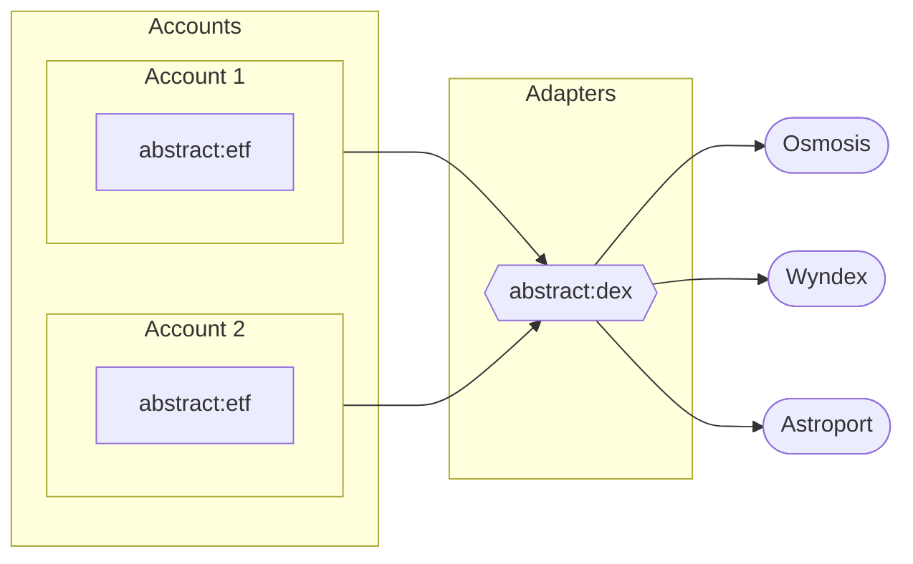

# Module Types

As explained in the previous section, a _module_ is a smart-contract that **extends an Account's functionality**. You can explore
all the available modules on the modules tab of your Account through
the <a href="https://console.abstract.money/modules" target="_blank">web-app</a>.

<!-- ```admonish info
In the previous sections we referred to these modules as "applications". We did this to simplify the mental framework of 
the Abstract SDK. However, the term "application" is not entirely accurate, instead we should refer to them as "modules". 
These modules come in different types, each with their own purpose. The most common of which is the "App" module, or 
"Abstract App".
``` -->

Modules are classified in the following categories:

- **App**: modules that add a functionality, exposing new entry-points for you or your users.
- **Adapter**: modules that act as a standard interface between your Account and external services.

## Module IDs

Every module is uniquely identified by a module ID. This ID is a string that follows the following format:

```text
<namespace>:<name>
```

The namespace is a string that resembles the publishing domain of a module developer, while the name is the name of the module itself. For example, the `abstract:etf` module is an App module developed by Abstract where `abstract` is the namespace and `etf` is the name of the module.

Additionally each module has a SEMVER version number that can be used to uniquely identify a specific version of a module, or just get the latest version. Module IDs and their versions are used to install modules on an Abstract Account.

A module ID is independent of the kind of module it refers to.

## Apps

An App module adds or alters the functionality of an Abstract Account, exposing new functions to you and/or your users.
This could range from adding advanced financial logic to data management features or permission systems,
depending on your use-case.

Each App module instance is exclusive to a single Abstract Account, **meaning the instance is created and owned by the Account**,
ensuring the owner has full control over the module's functionality and lifecycle. This level of control extends to the management of upgrades, maintenance, and any customization that might be required for the specific use case of the application.

```admonish info
The fact that users are in complete control over their applications is a feature that powers MyFi. A paradigm that we introduced in <a href="https://medium.com/abstract-money/abstract-introduces-myfi-a-case-study-cff2bc0e2e4d" target="_blank">this article.</a>
```

Because each Account has its own instance of an App, App modules can be tightly integrated with the Account's existing infrastructure. This includes the ability to interact directly with other modules (including Apps) installed on the same account, enabling powerful synergies and cross-module functionality.

```admonish example
The `abstract:etf` module is an app that allows external users to buy and sell "shares" in your Account, representing a portion of the Accounts' value.
```

## Adapters

Adapters serve as standard interfaces that facilitate communication between your Abstract Account and various external services. They act like bridges, enabling your account to interact with different smart contracts and blockchain services, thereby enhancing the interoperability of your applications.

The key function of an Adapter is to generalize functionality. Regardless of the underlying blockchain or smart contract protocol, the Adapter provides a standard interface that maintains consistency and simplifies the interaction process. As such, Adapters significantly simplify the developer experience and reduce the time required to integrate with various external systems.

Unlike other modules specific to each Abstract Account, Adapters are "global" in nature. This means that they are shared between multiple accounts. Due to this, **Adapter modules are not migratable**. This design choice is aimed at preventing supply-chain attacks that could potentially compromise the security of the Abstract ecosystem.

While individual Abstract Account owners can decide which Adapters and versions they wish to utilize, the overall control and maintenance of Adapters are handled at a platform level. This approach ensures that Adapters remain reliable, secure, and consistent across all Accounts.

```admonish example
The `abstract:dex` module allows Accounts to access standard functions on dexes with the same interface, regardless of whether they're local to the chain or across IBC.
```



<figcaption align = "center"><b>Two Accounts with the <code>abstract:etf</code> app module installed, using the <code>abstract:dex</code> adapter to interact with multiple dexes</b></figcaption>