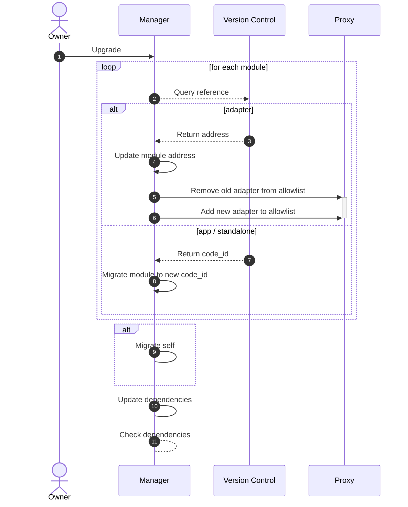

# Module Upgradability

Smart-contract migrations are a highly-debated feature in smart-contract development. Nonetheless Abstract believes it
to be a powerful feature that allows for fast product iteration. In the spirit of crypto we've designed a system that
allows for *permissionless software upgrades while maintaining trustlessness.*

## Module version storage

Permissionless software upgradeability is provided by a module version storage in
the [version control contract](../5_platform/2_version_control.md). The mapping allows your Account to:

- Instantiate a module of the latest versions.
- Upgrade a module to a new version as soon as it's available.
- Provide custom modules to other developers.
- Do all this without any third-party permissions.

There are two types of possible migration paths, although they appear the same to you as a developer.

## Migration Update

Most module updates will perform a contract migration. The migration can be evoked by the owner and is executed by
the manager contract. You can learn more about contract migrations in
the <a href="https://docs.cosmwasm.com/docs/smart-contracts/migration" target="_blank">CosmWasm documentation</a>.

## Move Updates

Some modules will not perform a regular contract migration, and this has to do with our module classification system.
Adapter modules for instance should not be migratable because it would remove the trustlessness of the system.

Therefore, if we still want to allow for upgradeable Adapters we need instantiate each Adapter version on a different
address.
When you as a developer decide to upgrade an Adapter module, the abstract infrastructure **moves** your Adapter
configuration to
the new addresses and removes the permissions of the old Adapter contract.

However, all other modules that depend on the upgraded Adapter module don't have to change any stored addresses as
module
address resolution is performed through the manager contract, similar to how DNS works!

## Upgrading Modules

One of the key strengths of Abstract is that it is designed to minimize your maintenance workload while maximizing the
control you have over your infrastructure.

Abstract manages module upgrades for you, ensuring your infrastructure remains intact and your workflows continue to
function smoothly through every upgrade. This process is carried out in a manner that consistently maintains the
integrity and security of your system.

The process for upgrading modules is shown in the following diagram:

An important aspect to point out of this process is how the integrity of the modules is ensured while performing the
upgrades. Proposed module upgrades are performed sequentially and keeping track of the changes in each module upgrade.
Additionally, version requirements and dependency checks are performed at the end of all the migrations to ensure module
compatibility.
