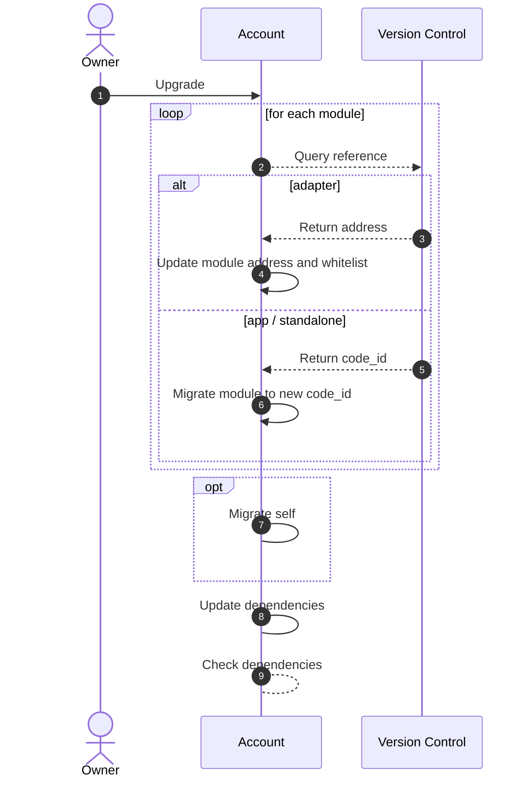

# Module Upgradability

Smart-contract migrations are a highly-debated feature in smart-contract development. Nonetheless Abstract believes it
to be a powerful feature that allows for fast product iteration and bug-fixing. In the spirit of crypto we've designed a system that
allows for **permissionless software upgrades while maintaining trustlessness.**

```admonish info
If this is the first time you hear about smart-contract migrations, we recommend you to read the <a href="https://docs.cosmwasm.com/docs/smart-contracts/migration" target="_blank">CosmWasm documentation</a> on the topic.
```

## Module Version Registry

Upgrading a module is facilitated by the module version registry in
the [version control contract](../5_platform/2_registry.md). The mapping allows your Account to:

- Instantiate a module of the latest versions.
- Upgrade a module to a new version.
- Provide custom modules to other developers.
- Do all this without losing sovereignty.

There are two types of possible upgrade paths, although they appear the same to you as a developer.

## Migration Upgrade

Most module updates will perform a contract migration. The migration can be evoked by the owner and is executed by
the account. Migrations apply to the App and Standalone module types.

## Move Upgrade

Adapter modules can not undergo any migrations. Therefore, each Adapter version is instantiated on a different
address.

When a user decides to upgrade an Adapter module, the abstract infrastructure **moves** that user's configuration on that Adapter  to the new Adapter and removes the permissions of the old Adapter.

However, any modules that depend on the upgraded Adapter module don't have to update any of their state as a module's address is resolved dynamically through the account contract, similar to how DNS works!

## Module Upgrade Flow

```mermaid info
You can skip this section if you're not interested in the technical details of how module upgrades work.
```

Abstract manages the state-management related to module upgrades for you, ensuring your infrastructure remains intact and your applications continue to function smoothly through every upgrade.

Upgrades are carried out in a manner that consistently maintains the integrity and security of your system. I.e. we programmed the system to **disallow** any upgrade actions that would break your system's version requirements.

The process for upgrading modules is shown in the following diagram:



An important aspect of this process is how the integrity of the modules is ensured.

Proposed module upgrades are performed sequentially and atomically while keeping track of all changes. As the last step in the upgrade flow a collection of version requirements and dependency checks are performed to ensure that module's dependencies are present and version-compatible.
