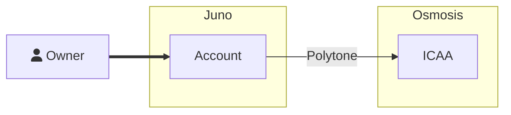
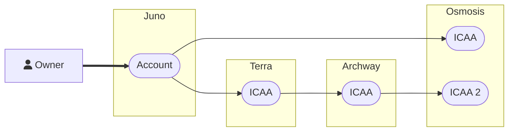
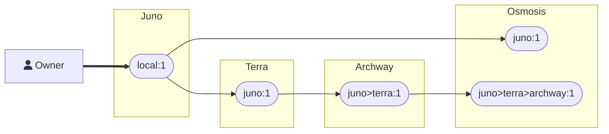

# Interchain Abstract Accounts

The Cosmos is going interchain. The arrival of Inter-Blockchain Communication (IBC) launched us into a new paradigm in
application development. New use-cases and solutions to existing UX problems are now possible. As the interchain
application platform, Abstract attempts to make IBC accessible to developers and users alike. In this section we'll
delve into interchain application development, what makes it so hard, and how Abstract can help you create your first
#Interchain application.

## What is The Interchain?

The Interchain, also known as the Internet of Blockchains, is a network of interconnected blockchains that interact through a shared protocol. This interaction is enabled by the Inter-Blockchain Communication (IBC) protocol, a communication standard akin to the TCP used amongst networked computers. IBC permits the transmission of any data variety between blockchains, allowing users to send data, such as tokens or messages, from one blockchain to another without relying on third-party trust. This innovation is a major breakthrough for the blockchain industry as it enables the formation of a blockchain network with independent communication capabilities, allowing for virtually infinite scale.

```admonish info
If you're interested in a visual representation of the interchain, check
out <a href="https://mapofzones.com/home?columnKey=ibcVolume&period=24h" target="_blank">the map of zones</a>.
```

## Building on The Interchain

Developers quickly started developing applications with IBC after its release. But they quickly ran into a major
problem. **IBC is not developer friendly.** It's a low-level protocol that requires extensive knowledge about its inner
workings. These problems were quickly recognized by the CosmWasm community. In response, DAO-DAO
built <a href="https://github.com/DA0-DA0/polytone" target="_blank">`Polytone`</a>, an Interchain Account (ICA) solution for CosmWasm
smart-contracts. This was a great step forward for interchain CosmWasm development, but it introduced its own
complexities and knowledge requirements.

As a response, Abstract has created its own ICA solution called Interchain Abstract Account (ICAA). The goal of ICAA is
multifold. First, it aims to make IBC accessible to developers by removing any knowledge requirements about the
underlying technology. Using IBC is as simple as enabling it on an Abstract Account and interacting with it through our
SDK. Second, it aims to make IBC a backend technology, unbeknown to users. Users should not have to know about IBC. They
should only have to know about the application they are using.

## Interchain Abstract Accounts (ICAA)

An Interchain Abstract Account is *an Abstract Account that is owned by another Abstract Account which is located on a
different chain*. This relationship is showcased in the diagram below.



When a user creates an Abstract Account they do so locally on whichever chain they prefer. In this scenario the user
opted to create his account on the Juno network.

After account creation the user (or his application) opted to create an ICAA on Osmosis. The ICAA creation is handled by
the Account Factory in a similar way to regular account creation. After successfully creating the ICAA, the user (and
his/her applications) can interact with the ICAA as if it were a regular account. Applications can send tokens to the
ICAA, execute smart-contract calls, request queries and more. With the help of Polytone, the ICAA returns the result of
these actions to the application.

```admonish info
The account creation process is covered in detail in the [Account Factory](../5_platform/3_account_factory.md) section.
```

ICAAs can be chained together, creating a network of accounts that can interact with each other. This allows for the
creation of complex applications that span multiple chains. The diagram below showcases this relationship.



Each of these accounts has a unique `AccountId` defined by the account's origin chain and the path over which it was
created. This allows the account's owner to decide how messages should be routed.



## Interchain Applications

We're now able to easily create *interchain applications*. I.e. a single smart-contract that we can deploy to multiple
blockchains that uses IBC to communicate about its state. Any chain-specific logic can be handled by the application's
dependencies, like the dex or staking adapter.

```admonish info
Need a refresher on adapters? Check out the [Adapters](../3_framework/6_module_types.md#adapters) section.
```
