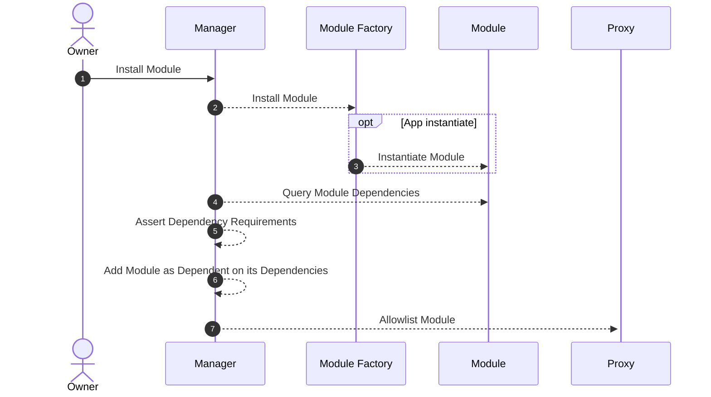

# Dependencies

A dependency is a piece of software or library that a project needs in order to function properly. For example, if a software application is built using a particular framework or library, that framework or library is considered a dependency of the application.
Dependency in code can be managed by the package manager. For example, in rust, we use `Cargo.toml` at the root of the project. In case of workspaces, dependencies are managed by parent project.
Learn more about [dependencies in rust](https://doc.rust-lang.org/cargo/reference/specifying-dependencies.html) before proceeding.

## Module Dependencies

In the Abstract SDK, modules have conditions that must be met before they can be installed. These
conditions largely revolve around module dependencies and version requirements. When installing a module, the system will
check its dependencies and ensure that they are installed and meet the version requirements specified by the module.

Here's how the process of installing a module and checking module dependencies looks:



## Specifying Dependency

Abstract Apps are completely modular. So, each Abstract App can have it's own set of dependencies that can be added as per need.

Let's see how that looks like. First you'd need to import the dependency in your file:

```rust
use croncat_app::contract::{CRONCAT_ID, CRONCAT_MODULE_VERSION};
```

Then you can add it to your app `.with_dependencies()`:

```rust
DCAApp::new(DCA_APP_ID, DCA_APP_VERSION, None)
.with_dependencies(&[
    StaticDependency::new(CRONCAT_ID, &[CRONCAT_MODULE_VERSION]),
]);
```

`StaticDependency` defines how the dependency is supposed to be imported and used. It contains `id` of the module and `version` of the module.

```rust
pub struct StaticDependency {
    pub id: ModuleId<'static>,
    pub version_req: &'static [&'static str],
}
```

`StaticDependency` also has `check` and `matches` functions. `check` tells you if the version requirement is valid and `matches` finds the most compatible version requirement.

`version` uses uses [Semantic Versioning (SemVer)](https://semver.org/) for its packages. You can specify dependencies using exact versions, version ranges, or other qualifiers to ensure compatibility of your modules.
