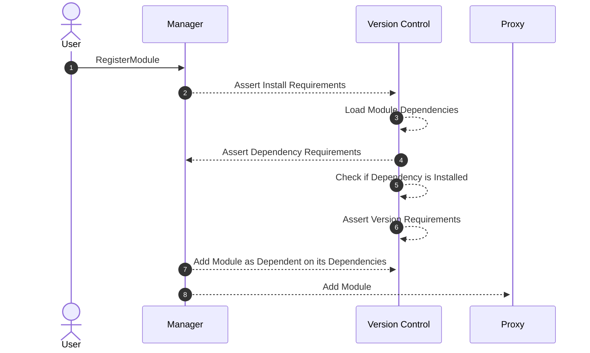

# Module Dependencies

In the Abstract SDK, modules have conditions that must be met before they can be registered or activated. These
conditions largely revolve around module dependencies and version requirements. When installing a module, the system will
check its dependencies and ensure that they are installed and meet the version requirements specified by the module.

Here's how the process of registering a module and checking module dependencies looks:

