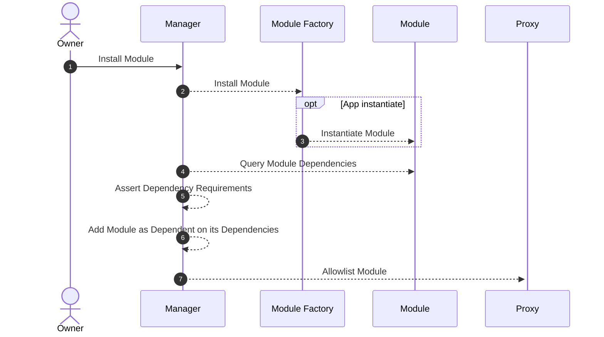

# Dependencies

A dependency is a piece of software or library that a project needs in order to function properly. For example, if a software application is built using a particular framework or library, that framework or library is considered a dependency of the application.
Dependency in code can be managed by the package manager. For example, in rust, we use `Cargo.toml` at the root of the project. In case of workspaces, dependencies are managed by parent project.
Learn more about [dependencies in rust](https://doc.rust-lang.org/cargo/reference/specifying-dependencies.html) before proceeding.

Your module might depend on some other module being enabled on the Account. Abstract allows you to address that module and perform actions on it through a dependency system. These dependencies are checked on-chain when you upgrade your modules.

## Module Dependencies

In the Abstract SDK, modules have conditions that must be met before they can be installed. These
conditions largely revolve around module dependencies and version requirements. When installing a module, the system will
check its dependencies and ensure that they are installed and meet the version requirements specified by the module.

Here's how the process of installing a module and checking module dependencies looks:



### Declaring Dependencies

To declare a dependency, we recommend creating a `dependencies.rs` file in your contract `src` directory. Say, for instance, your module depended on the DEX API with a version constraint of `>=0.3.0`. Your dependencies would look as follows:

```rust
use abstract_sdk::core::EXCHANGE;
use abstract_sdk::core::objects::dependency::StaticDependency;

const DEX_DEP: StaticDependency = StaticDependency::new(EXCHANGE, &[">=0.3.0"]);

/// Dependencies for the module

pub const BALANCER_DEPS: &[StaticDependency] = &[DEX_DEP];
```

Import these deps in your `contract.rs` where you have already referenced your entry point methods:

```rust
const APP: BalancerApp = BalancerApp::new(BALANCER, MODULE_VERSION, None)
.with_instantiate(handlers::instantiate_handler)
// ...
.with_dependencies(BALANCER_DEPS);
```

`StaticDependency` defines how the dependency is supposed to be imported and used. It contains `id` of the module and `version` of the module.

```rust
pub struct StaticDependency {
    pub id: ModuleId<'static>,
    pub version_req: &'static [&'static str],
}
```

`version` uses uses [Semantic Versioning (SemVer)](https://semver.org/) for its packages. You can specify dependencies using exact versions, version ranges, or other qualifiers to ensure compatibility of your modules.

```admonish info
Make sure to keep an eye out for deprecating dependencies as well. Security updates are a must to update and some patches can be ignored.
```

### Addressing other modules

If your module needs some modules to be enabled, it can add those as a dependency. You can then easily call messages on these modules by using the ModuleInterface trait as described in [Dependency Execution Flow](https://docs.abstract.money/3_framework/6_module_types.html#dependency-execution).

Under the hood the ID of the dependency module will be resolved on the Manager contract, returning the address of that module. The address is then used to call or query the dependency. 

You can also query dependencies using the same trait or by performing a raw-query provided by the SDK.

### Testing

Because the dependencies are parsed and unwrapped on-chain, you should have a sanity check on your dependencies, which can be as simple as:

```rust
#[cfg(test)]
mod tests {
    use semver::Comparator;
    use super::*;

    #[test]
    fn test_dependencies() {
        BALANCER_DEPS.iter().for_each(|dep| {
            dep.version_req.iter().for_each(|req| {
                Comparator::parse(req).unwrap();
            });
        });
    }
}
```
