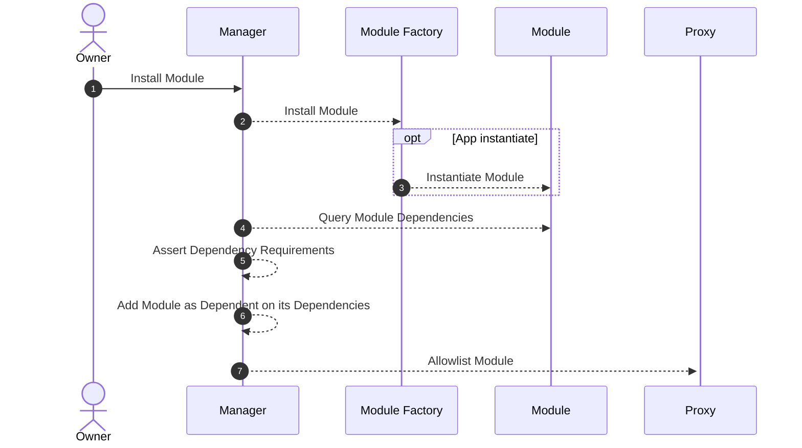

# Dependencies

A dependency is a piece of software that a developer relies on to implement his/her own application. By relying on this external code, the developer doesn't need to implement the dependency's functionality himself.

Abstract allows you to add other smart contracts as dependencies to your module. Doing so enables you to keep your app's complexity low and focus on the core functionality of your module while leveraging the functionality of battle-tested code.

Your module's configured dependencies are asserted on-chain when your module is instantiated. This way Abstract ensures that all dependencies are met before your module is installed, preventing API mis-matches and other issues.

## Declaring Dependencies

Declaring a dependency is a two-step process:

First, you specify the dependency itself using the `StaticDependency` struct. The struct contains the ID for the module you wish to depend on, as well as an array of version requirements. The formatting and assertion of these requirements are identical to [Cargo's version requirement functionality](https://doc.rust-lang.org/cargo/reference/specifying-dependencies.html).

```rust
use abstract_app::std::EXCHANGE;
use abstract_app::std::objects::dependency::StaticDependency;

const DEX_DEP: StaticDependency = StaticDependency::new(EXCHANGE, &[">=0.3.0"]);
```

Once configured, you can add the dependency to your module using the `with_dependencies` method on the `App` struct. This method takes a slice of `StaticDependency` structs and asserts that all dependencies are met when the module is instantiated.

```rust
const APP: BalancerApp = BalancerApp::new(BALANCER, MODULE_VERSION, None)
// ...
.with_dependencies(&[DEX_DEP]);
```

You can now safely start using the [Abstract APIs](./4_sdk.md) that should be included in any of your dependencies.

<!-- `StaticDependency` defines how the dependency is supposed to be imported and used. It contains `id` of the module and `version` of the module.

```rust
pub struct StaticDependency {
    pub id: ModuleId<'static>,
    pub version_req: &'static [&'static str],
}
```

`version` uses uses [Semantic Versioning (SemVer)](https://semver.org/) for its packages. You can specify dependencies using exact versions, version ranges, or other qualifiers to ensure compatibility of your modules.

```admonish info
Make sure to keep an eye out for deprecating dependencies as well. Security updates are a must to update and some patches can be ignored.
```

### Addressing other modules

If your module needs some modules to be enabled, it can add those as a dependency. You can then easily call messages on these modules by using the ModuleInterface trait as described in [Dependency Execution Flow](https://docs.abstract.money/3_framework/6_module_types.html#dependency-execution).

Under the hood the ID of the dependency module will be resolved on the Manager contract, returning the address of that module. The address is then used to call or query the dependency.

You can also query dependencies using the same trait or by performing a raw-query provided by the SDK. -->

## Module Dependency Assertion

For the curious, here's how the process of installing a module and checking module dependencies looks:


