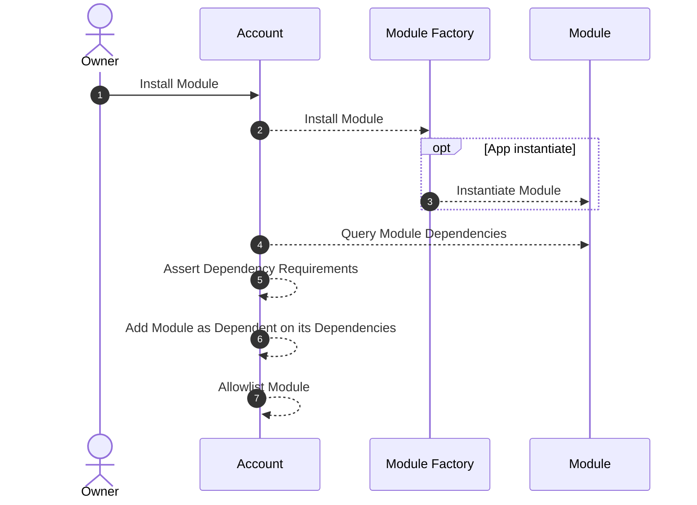

# Dependencies

A dependency is a piece of software that a developer relies on to implement his/her own application. By relying on this external code, the developer doesn't need to implement the dependency's functionality himself.

Abstract allows you to add other smart contracts as dependencies to your module. Doing so enables you to keep your app's complexity low and focus on the core functionality of your module while leveraging the functionality of battle-tested code.

Your module's configured dependencies are asserted on-chain when your module is instantiated. This way Abstract ensures that all dependencies are met before your module is installed, preventing API mis-matches and other issues.

We'll cover how to declare your dependencies and then how to ensure you have them installed them before you try to install your own module.

## Declaring Dependencies

Declaring a dependency is a two-step process:

First, you specify the dependency itself using the `StaticDependency` struct. The struct contains the ID for the module you wish to depend on, as well as an array of version requirements. The formatting and assertion of these requirements are identical to [Cargo's version requirement functionality](https://doc.rust-lang.org/cargo/reference/specifying-dependencies.html).

```rust
use abstract_app::std::EXCHANGE;
use abstract_app::std::objects::dependency::StaticDependency;

const DEX_DEP: StaticDependency = StaticDependency::new(EXCHANGE, &[">=0.3.0"]);
```

Once configured, you can add the dependency to your module using the `with_dependencies` method on the `App` struct. This method takes a slice of `StaticDependency` structs and asserts that all dependencies are met when the module is instantiated.

```rust
const APP: BalancerApp = BalancerApp::new(BALANCER, MODULE_VERSION, None)
// ...
.with_dependencies(&[DEX_DEP]);
```

You can now safely start using the [Abstract APIs](./4_sdk.md) that should be included in any of your dependencies.

## Dependency Installation

Before you can install your own module you must install all your module's dependencies. To do this we provide a `DependencyCreation` trait that you should implement for your module. The goal of the trait is to enable you to configure which dependencies should be installed and with which parameters.

Here's an example using our dollar-cost-average app that depends on CronCat and our DEX adapter.

```rust
{{#include ../../../../modules/contracts/apps/dca/src/contract.rs:deps_creation}}
```

Neither dependencies require any configuration on instantiation so the `DependenciesConfig` can be `Empty`.

The `dependency_install_configs` function should return all the `ModuleInstallConfig`s that are required to install the dependencies for your application. In this example the configs are comprised of:

1. Any dependencies that might be required by the CronCat App.
2. The CronCat App itself.
3. The DEX Adapter.

With these specified, our `abstract-client` crate can install all your modules and their dependencies when you install your app, like so:

```rust
{{ #include ../../../packages/abstract-client/tests/integration.rs:account }}
```

The next section goes deeper into the `abstract-client` and how you can use it create accounts, publish modules and install your modules!

## Module Dependency Assertion

For the curious, here's how the process of installing a module and checking module dependencies looks:


