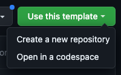

# Recreating the carrot app from Abstract

This tutorial will walk you through the process of recreating the carrot-app

## Step by step guide

1. Go to <a href="https://github.com/AbstractSDK/app-template" target="_blank">our App Template on Github</a> and click on the "Use this template" button to create a new repository based on the template. You can name the repository whatever you want, but we recommend using the name of your module.



2. Let's call the repository `carrot-app-tutorial` and click `Create repository`
3. go to your terminal

```sh
# replace `YOUR_GITHUB_ID` with your actual github ID
git clone https://github.com/YOUR_GITHUB_ID/carrot-app-tutorial.git
cd carrot-app-tutorial
```

4.

```sh
chmod +x ./template-setup.sh
./template-setup.sh
# press (y) to install tools that we will need as we go
```

What we have now is a counter app serving as a template.
By looking at the `handlers/execute.rs` file you can see that the contract allows to incrementent or reset the counter.

```rust
match msg {
        AppExecuteMsg::Increment {} => increment(deps, app),
        AppExecuteMsg::Reset { count } => reset(deps, info, count, app),
        AppExecuteMsg::UpdateConfig {} => update_config(deps, info, app),
    }
```

5. Let's replace these messages by what we want to have in the carrot-app
   What we want is the possibility to create a position for a specific Liquidity pool, be able to add more funds to it, withdraw from it and autocompound.

```rust
// in handlers/execute.rs
match msg {
        // Create a position for a supercharged liquidity pool
        // Example: A user wants to create a liquidity position with 1000USDC and 1000USDT within a specifc range
        AppExecuteMsg::CreatePosition(create_position_msg) => {
            create_position(deps, env, info, app, create_position_msg)
        }
        // This adds funds to an already existing position
        // Example: A user who has already a position with 1000USDC and 1000USDT would like to add 200USDC and 200USDT
        // This function is Permissioned
        AppExecuteMsg::Deposit { funds } => deposit(deps, env, info, funds, app),
        // This withdraws a share from the LP position
        // Example: A user who has already a position with 1000USDC and 1000USDT would like to withdraw 200USDC and 200USDT
        // Note: This will not claim the rewards earned from the swapping fees generated by the position
        // This function is Permissioned
        AppExecuteMsg::Withdraw { amount } => withdraw(deps, env, info, Some(amount), app),
        // This withdraws all the amount in the position
        // Example: A user who has already a position with 1000USDC and 1000USDT would like to withdraw all the funds
        // Note: This will not claim the rewards earned from the swapping fees generated by the position
        // This function is Permissioned
        AppExecuteMsg::WithdrawAll {} => withdraw(deps, env, info, None, app),
        // For a user who has already created a position, this function does in two steps:
        // 1- claims all the rewards generated by the position
        // 2- adds/deposits the claimed rewards to that same position
        // This is meant to be called by a carrot-app bot, that receives rewards upon autocompounding.
        // This function is Permissionless
        AppExecuteMsg::Autocompound {} => autocompound(deps, env, info, app),
    }
```

6. Now this `AppExecuteMsg` enum and those arm functions are not yet defined so let's define them

#### Define `AppExecuteMsg` enum

Let's replace the `AppExecuteMsg` enum from the Counter code

```rust
/// App execute messages
#[cosmwasm_schema::cw_serde]
#[cfg_attr(feature = "interface", derive(cw_orch::ExecuteFns))]
#[cfg_attr(feature = "interface", impl_into(ExecuteMsg))]
pub enum AppExecuteMsg {
    /// Increment count by 1
    Increment {},
    /// Admin method - reset count
    Reset {
        /// Count value after reset
        count: i32,
    },
    UpdateConfig {},
}
```

with this

```rust
// in msg.rs
/// App execute messages
#[cosmwasm_schema::cw_serde]
#[cfg_attr(feature = "interface", derive(cw_orch::ExecuteFns))]
#[cfg_attr(feature = "interface", impl_into(ExecuteMsg))]
pub enum AppExecuteMsg {
    /// Create the initial liquidity position
    CreatePosition(CreatePositionMessage),
    /// Deposit funds onto the app
    Deposit { funds: Vec<Coin> },
    /// Partial withdraw of the funds available on the app
    Withdraw { amount: Uint128 },
    /// Withdraw everything that is on the app
    WithdrawAll {},
    /// Auto-compounds the pool rewards into the pool
    Autocompound {},
}
```

#### Define the Match msg arm functions

Now we define the functions that hold the logic of what these entrypoints do

```rust
// in handlers/execute.rs
fn create_position(deps: DepsMut, env: Env, info: MessageInfo, app: App,create_position_msg: CreatePositionMessage,) -> AppResult {
    Ok(app.response("create_position"))
}
fn deposit(deps: DepsMut, env: Env, info: MessageInfo, funds: Vec<Coin>, app: App) -> AppResult {
    Ok(app.response("deposit"))
}
fn withdraw(deps: DepsMut, env: Env, info: MessageInfo, app: App) -> AppResult {
    Ok(app.response("withdraw"))
}
fn autocompound(deps: DepsMut, app: App) -> AppResult {
    Ok(app.response("autocompound"))
}
```

1. Let's start with the create_position. In order for the contract to be able to create a position for osmosis supercharged pools it needs certain data like the liquidity pool to open the position in and the ticks that define the range in which your assets will be available for swapping.

```rust
// in msg.rs
// We define the input data needed for the creation of the position
#[cosmwasm_schema::cw_serde]
/// Osmosis create position msg
pub struct CreatePositionMessage {
    pub lower_tick: i64,
    pub upper_tick: i64,
    /// Funds to use to deposit on the account
    pub funds: Vec<Coin>,
    /// The two next fields indicate the token0/token1 ratio we want to deposit inside the current ticks
    pub asset0: Coin,
    pub asset1: Coin,
}
```
