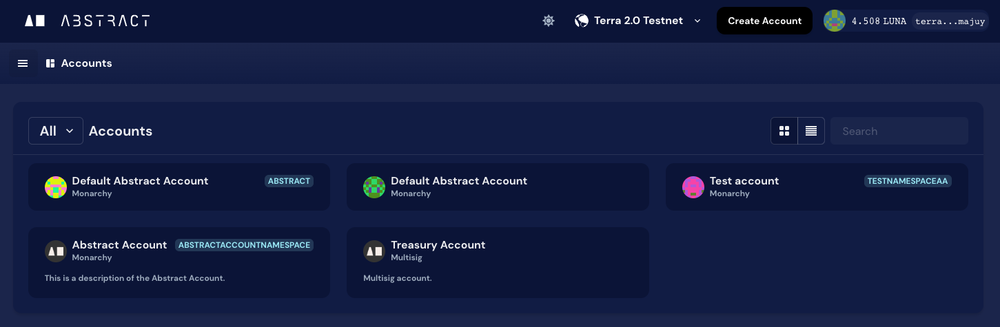
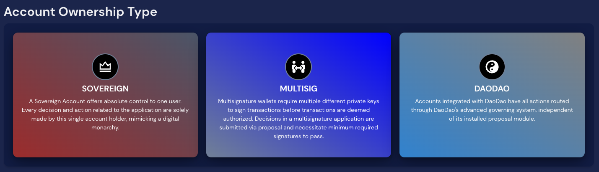
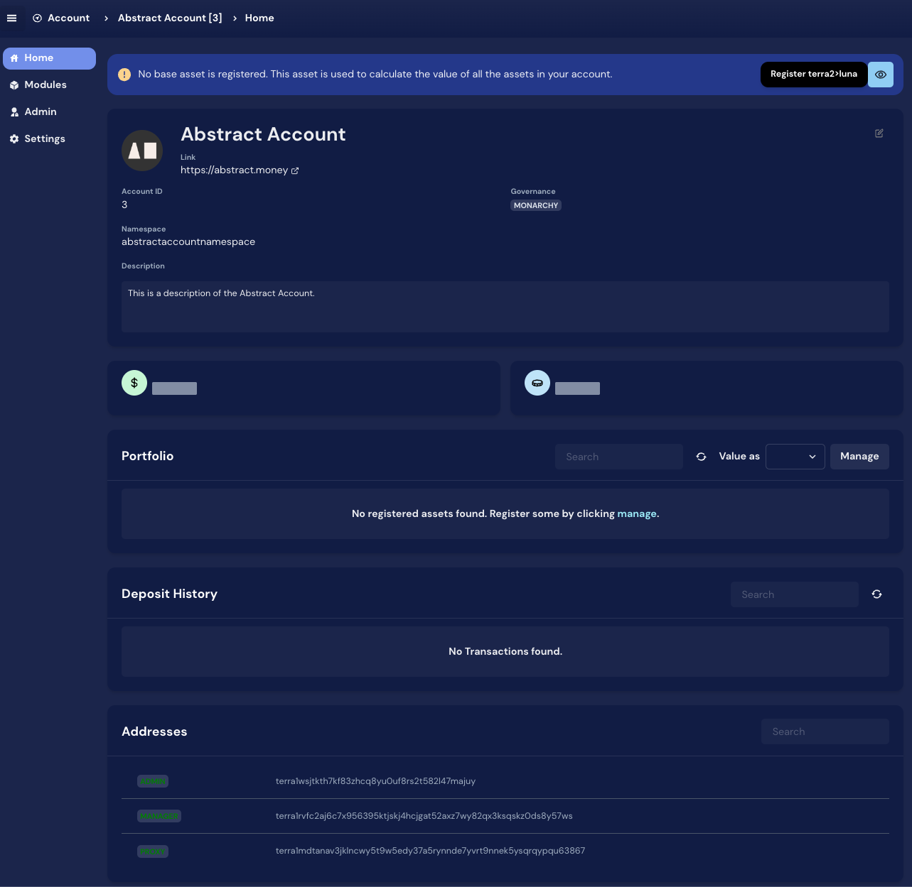

# Account Console

```admonish warning
The [Account Console](https://console.abstract.money) is in beta. Please report any issues you encounter on our Discord.
```

The [Account Console](https://console.abstract.money) is a web-based developer tool that allows you to inspect and interact with your Abstract Accounts.

It also allows you to easily view the abstract-specific infrastructure details like the [Abstract Name Service](./1_ans.md) or the [Version Control](2_registry.md).

The Account Console offers:

- **Account Management**: Create, update, and delete accounts.
- **Module Management**: Install, update, and delete modules.
- **Name Service**: Register and manage human-readable names for your accounts.
- **Dev Tools**: Visual contract message builder, contract explorer, and more.

```admonish info
Note that using the Console is not required to develop on Abstract. All the features available in the console can be accessed programmatically using the [Abstract Client crate](../4_get_started/5_abstract_client.md). Using the Abstract Client crate is recommended for production use cases.
```



## Accessing the Account Console

You can access the Account Console where you can create an account, claim namespaces and more by
visiting <a href="https://console.abstract.money/" target="_blank">console.abstract.money</a>. You will be able to select the
network you want to connect to, and then proceed to create your Abstract Account.

## Account Management

### Create Account

Creating an account is straightforward process. Once in the Account Console, click "Create Account". You will be able
to select the network you want to connect to, and then proceed to create your Abstract Account.

> Are you having trouble creating an account? Please <a href="https://discord.gg/uch3Tq3aym" target="_blank">contact us
> on Discord</a> and we'll help you out.



Once the account is created, you can see the overview of the account, including the manager and the proxy contracts,
among other details.



### Claim a Namespace

Now that you have your account you can proceed to claim your namespace. The namespace will be exclusively linked to your
Abstract Account and will prefix your module names to form a unique module identifier.

> For example, if your namespace is `myapp` and your module name is `mymodule` then your module identifier will
> be `myapp:mymodule`.

You can easily claim your namespace by going to your Account on our website and click the "Claim Namespace" button on
the account page. You will be asked to pay a small fee to claim your namespace. This fee is used to prevent namespace
squatting and to help us maintain the Abstract ecosystem.

```admonish info
Please be aware that you need access to claim namespace on mainnet. Reach out to us on [discord](https://discord.com/invite/uch3Tq3aym).
```
