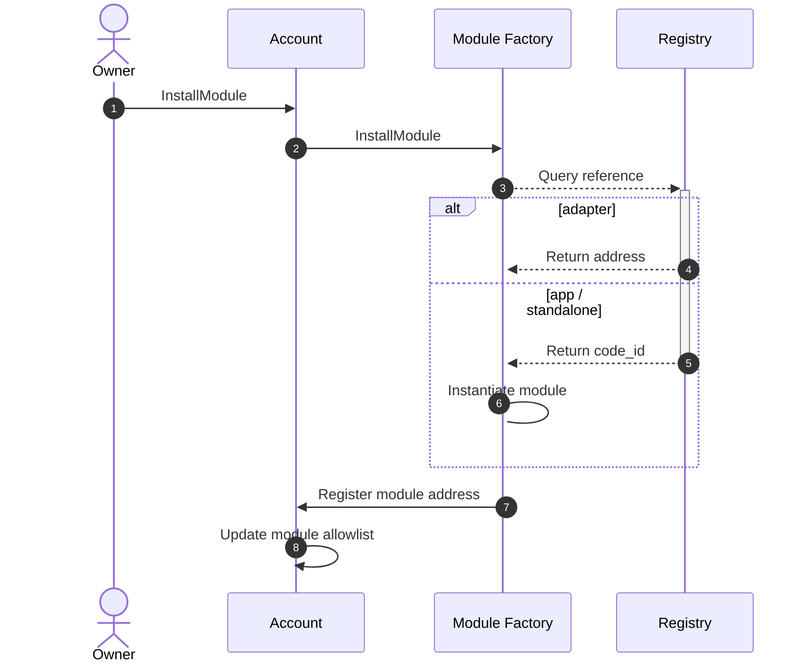
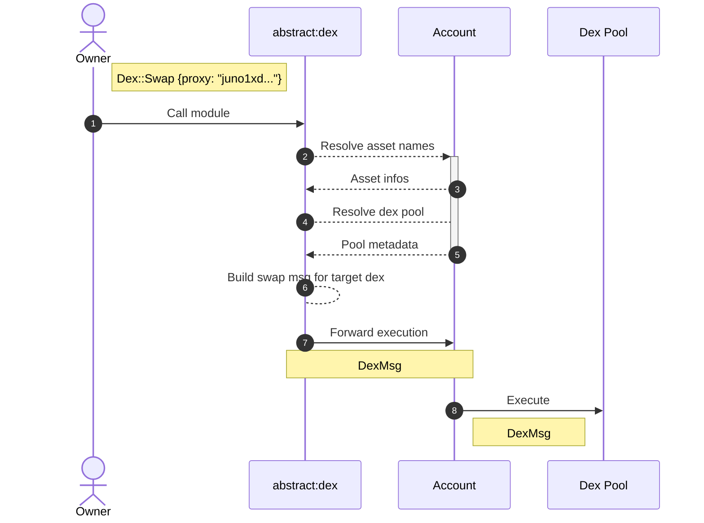
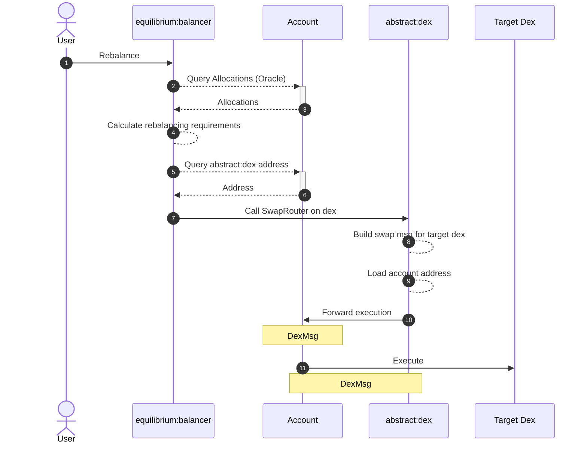

# Module Factory

The Module Factory is a contract that allows Account owners to install and manage Abstract Modules for their Account. You can install modules by interacting with the Account directly, i.e. via CLI, or by using the [Account Console](4_account_console.md).

To recap from [that chapter](../3_framework/6_module_types.md), there are three types of modules: App, Adapter, and Standalone.

## Flow Diagrams

### Install Module

When a developer requests the installation of a module, the following internal process is initiated:

<figcaption align = "center"><b>Installation of a module</b></figcaption>

## Execute on Module

Once the module is installed, there are essentially three ways to interact with it depending on the type of module:

### Owner Execution

The owner of an Account can always execute on the module directly, even if the module is installed on a sub-account.

<figcaption align = "center"><b>Module Execution</b></figcaption>

### Adapter Execution

In the following example, the `abstract:dex` module is installed on an Account and the user requests a swap on a dex. This swap will use the funds held in the Account to execute the swap on the target dex.

<figcaption align = "center"><b>Adapter Execution</b></figcaption>

### App Execution w/ Dependencies

In this example, we use [Equilibrium](../7_use_cases/equilibrium.md)'s `Rebalance` permissionless function as an example. Modules with
dependencies (`equilibrium:balancer` is dependent on `abstract:etf` and `abstract:dex`) have their addresses dynamically
resolved when called.

<figcaption align = "center"><b>Dependent Execution</b></figcaption>
