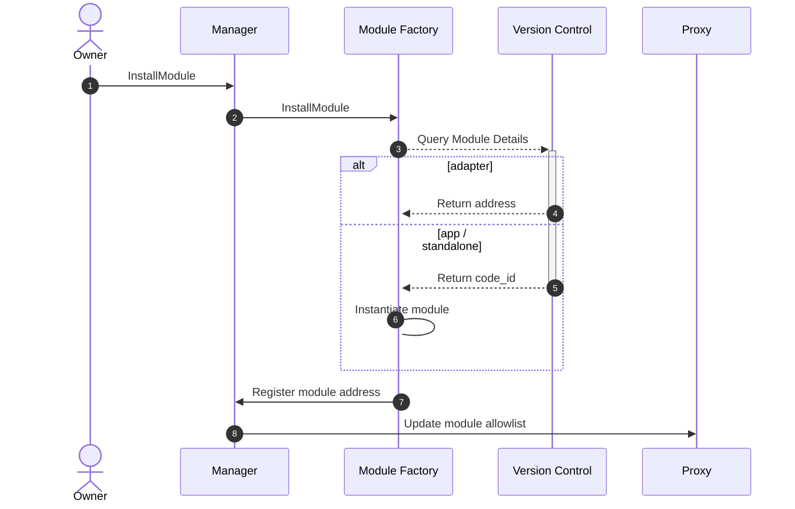
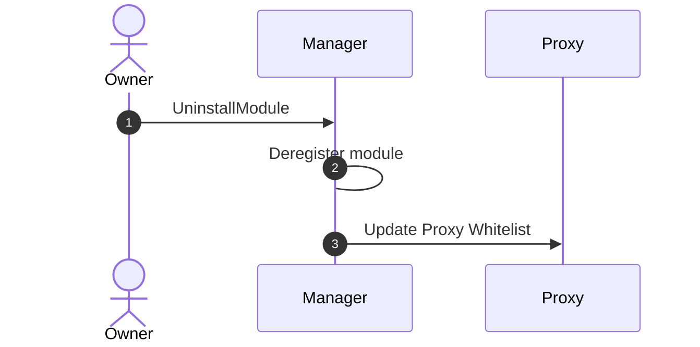
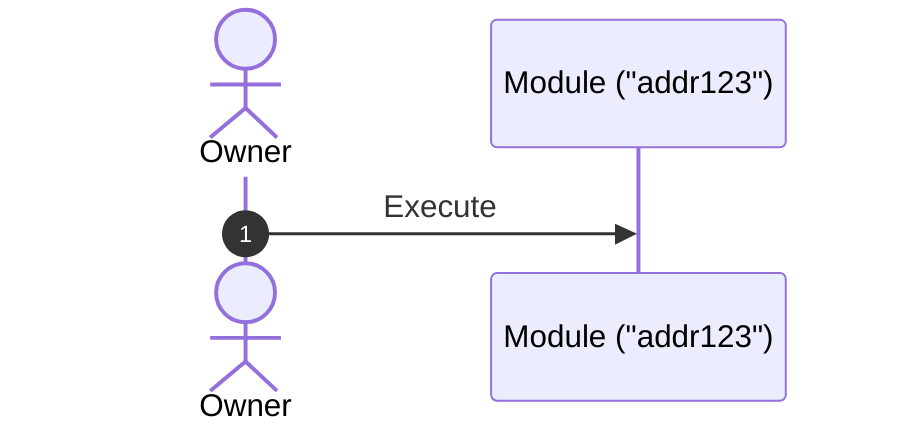
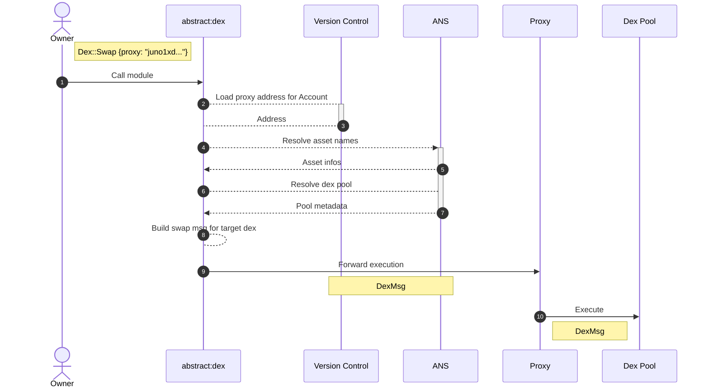
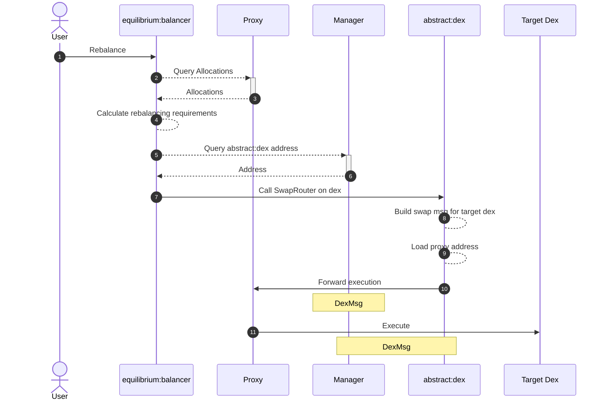

# Module Flows

Module instantiation and execution is a process that is somewhat hidden from the end-user and developer. This section aims to elaborate on the message execution flows for these actions.

## Installing and Uninstalling Modules

The following are sequence diagrams of the process of installing and uninstalling a module on an Abstract Account. As
you can see, the process happens via the Manager, and it can be done by the Account owner through
the [web-app](https://console.abstract.money/).



<figcaption align = "center"><b>Installing a Module</b></figcaption>

At this point you should be able to understand the message flow depicted above. Just to be sure, we'll briefly outline the process's steps.

Installing a module starts by the Owner of the Account requesting the installation of the module on the Account. This request is sent to the Manager contract of the Account. The request contains the module ID(s) and possible instantiate messages for any App/Standalone modules that should be installed (aka instantiated).

The Manager contract verifies the request and forwards it to the Module Factory. The Module Factory then queries the Version Control (the on-chain module registry) for the module details. These module details contain both the version of the module as well as its type-specific data. This type-specific data is depicted by the two alternatives (alt) of the returned query.

Either the query returns an Adapter's address (which is already instantiated) or it returns an App/Standalone code-id. This code-id is then used by the Module Factory to instantiate an instance of that module.

After instantiating the modules the Manager registers the modules internally and updates the whitelist on the Account's Proxy contract. This whitelisting provides the modules with the ability to proxy message execution through the Account.



<figcaption align = "center"><b>Uninstalling a Module</b></figcaption>

Uninstalling a Module follows a similar execution flow as shown above.

```admonish info
In both flows we omitted the dependency-check logic, which will be discussed in more detail [later](../4_get_started/8_dependencies.md).
```

<!-- ## How to Use Modules in Your Project

Leveraging modules in your project can significantly simplify the development process, allowing you to deploy projects
faster and more cost-effectively than building traditionally. By using pre-built, tested, and community-reviewed
modules, you can focus on your project's unique features while reducing development time and minimizing potential bugs.

Here's an example of how modules can be leveraged for a decentralized finance (DeFi) project:

Imagine you want to create a DeFi application with the following features:

- A fungible token for your platform
- Staking and delegation functionality
- A governance system for community-driven decision-making
- Integration with an oracle for fetching off-chain data

Instead of building each feature from scratch, you can leverage Abstract's off-the-shelf modules to implement these
functionalities with ease. This not only saves time and resources but also ensures that your project benefits from the
best practices established by the Abstract community.

**Step 1**

Choose the module of your choice on the Abstract SDK. You can see the available modules on
our <a href="https://github.com/AbstractSDK/abstract/tree/main/modules" target="_blank">repository</a>.

**Step 2**

Import the chosen modules into your project and configure them according to your requirements. This can
include setting custom parameters, such as token supply, staking rewards, or voting thresholds.

**Step 3**

Integrate the modules with your existing codebase, ensuring they work seamlessly with your project's unique
features. This can involve calling module functions, implementing hooks, or extending your data structures.

**Step 4**

Test your dApp thoroughly to ensure the modules function as intended and do not introduce any unexpected
behavior.

By leveraging Abstract's modules in this way, you can rapidly build and deploy your DeFi project while benefiting from
the robustness and flexibility of the Abstract ecosystem. -->

## Example Execution Flows

The following are sequence diagrams of the process of executing a function on a module of an Abstract Account. We show three examples of executing a module: Owner Execution, Adapter Execution, and Dependency Execution.

Let's explore each of them.

### Owner Execution

To execute a (permissioned) message on a specific module, the Owner can call the module directly. The Module knows who the Owner of the Account is.



### Adapter Execution

In the following example, the `abstract:dex` adapter is installed on an Account, and the Owner requests a swap on a dex. By providing the proxy address of the Account in the call, the adapter can assert that the caller is the Owner of the Account.



### Dependency Execution

In this example, we use the [Equilibrium App](../7_use_cases/equilibrium.md)'s `Rebalance` function as an example. Modules
with dependencies (`equilibrium:balancer` is dependent on `abstract:etf` and `abstract:dex`) have their addresses
dynamically resolved when called.


s
