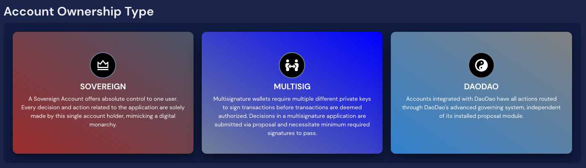
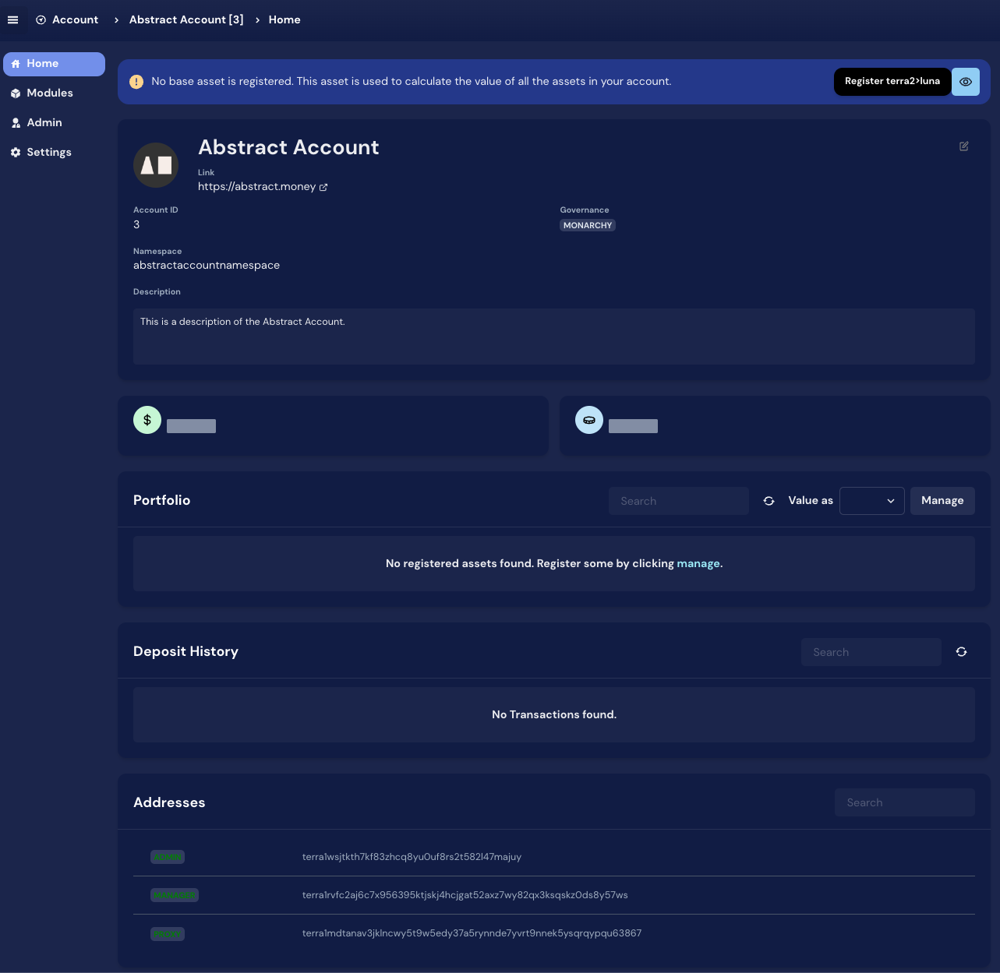

# Account Console

The Account Console is a web-based interface that allows you to interact with your Abstract Accounts. It is a powerful
tool containing all the features you need not only to manage your accounts but also help you develop your application,
including:

- **Account Management**: Create, update, and delete accounts.
- **Module Management**: Install, update, and delete modules.
- **Name Service**: Register and manage human-readable names for your accounts.
- **Dev Tools**: Contract message builder given the json schema, tools for contract interactions, signing transactions,
  add assets to your ANS and deployment configurations.
- **Delegations**: Delegate your voting power to a validator of your choice.

## Accessing the Account Console

You can access the Account Console by visiting <a href="https://app.abstract.money/" target="_blank">
app.abstract.money</a>. You will be able to select the network you want to connect to, and then proceed to create your
Abstract Account.

## Account Management

### Create Account

To create an account, click on the "Create Account" button in the top right corner of the screen. You will be prompted
what type of account you want to create. You can choose among "Sovereign", "Multisig" or "DAODAO" accounts, and fill in
the details you want the account to have.

Once the account is created, you can see the overview of the account, including the manager and the proxy contracts,
among other details.

