# Account Factory

The Account Factory is a contract that allows you to create and
manage Abstract Accounts, which can be interacted with via the contract or the [Account Console](account_console.md).

To recap from [that chapter](../3_framework/4_architecture.md), an Abstract Account is composed of a Manager and a Proxy
contract. Those contracts will be created for you by the Account Factory using the latest versions of these contracts,
which are store on the [Version Control](version_control.md) contract.

## Flow Diagram

When a developer requests the creation of an account, the following internal process is initiated:

```mermaid
sequenceDiagram
    autonumber
    actor U as User
    participant F as Account Factory
    participant VC as Version Control
    participant M as New Manager
    participant P as New Proxy

    U ->> F: CreateAccount
    F -->>+ VC: Query for Manager reference
    VC -->>- F: Manager code_id


F-x+M: Instantiate Manager
Note over VC: Reply
M-->>-F: Manager Address
F->F: Store manager address


F-->>+VC: Query for Proxy reference
VC-->>-F: Proxy code_id
F-x+P: Instantiate Proxy
Note over VC: Reply
P-->>-F: Proxy Address


F->>VC: Register Account
F->>M: Register proxy address
F->>P: Allowlist Manager address
F->>P: Set owner to Manager
F->>M: Set migrate admin to Self
```

If you want to see in details how this is accomplished, please refer to
our <a href="https://github.com/AbstractSDK/abstract/tree/main/framework/contracts/native/account-factory" target="_blank">
Github repository</a>.