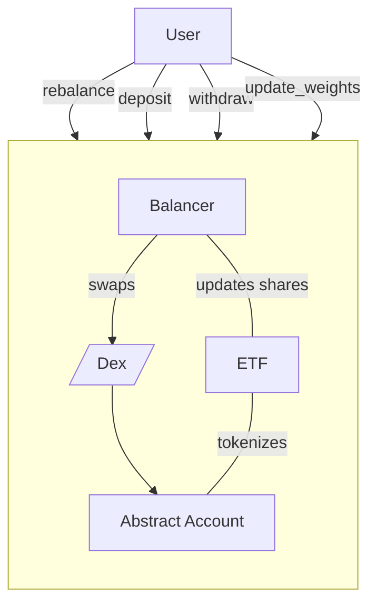

# Equilibrium Rebalancer

Equilibrium, 1st place winner of HackWasm 2022, is a rebalancing protocol for DeFi portfolios. It allows users to create weighted baskets of assets and supports rebalancing of the portfolio using liquidity on any Dex in the interchain ecosystem, local or remote.

## Architecture

### Modules

- [Dex Adapter](../modules/dex.md)
- [IBC Client](../3_framework/8_ibc.md)
- Balancer:

Read more on equilbrium on its <a href="https://equilibrium.zone/" target="_blank">official
website</a>.
