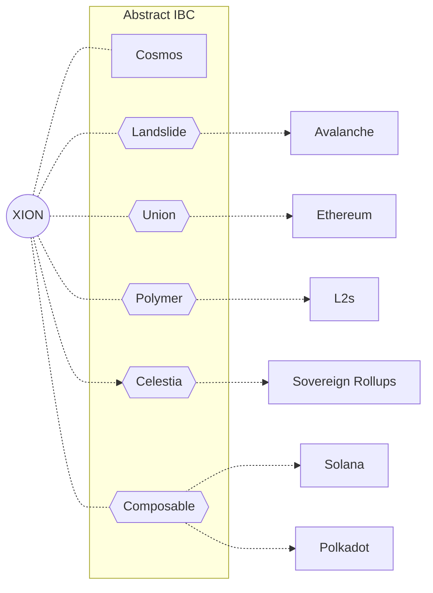

# XION

[XION](https://xion.burnt.com) is consumer-oriented chain focused on eliminating the complexities of Web3 interaction through "generalized abstraction," offering users the ability to interact with apps and liquidity on any chain.

XION uses Abstract's [ICAAs](../3_framework/8_ibc.md) to enable chain abstraction and for full control and programmability of any chain over IBC.

```admonish info
Mint an NFT on Neutron directly from XION [here](https://xion.abstract.money)! This demonstration walks you through each step of the process, though all actions can be fully abstracted away in practice.
```

## Statistics

As of July 15th, 2024, XION has:

- 160K+ Abstract Accounts
- 150K+ Interchain Abstract Accounts on Neutron
- 400K+ Transactions, 300K of which were cross-chain



## Articles

- [XION Launches Chain Abstraction to Neutron via Abstract](https://xion.burnt.com/blog/xion-launches-chain-abstraction-to-neutron-via-abstract)
