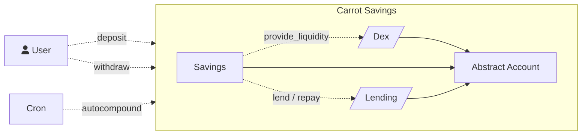

# Carrot Savings

Carrot Savings is an interchain stablecoin yield aggregator and optimizer, designed to give users the best stablecoin yields using DeFi protocols.

```admonish info
[Carrot Savings is live](https://carrotsavings.com)! Deposit and withdraw USDC and get over 20% yield (as of July 15, 2024).
```

### Modules

- [Dex Adapter](../modules/dex.md)
- [Lending Market Adapter](../modules/lending-market.md)
- Savings: stablecoin position management

## Architecture


