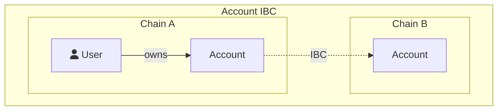
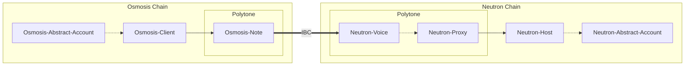

# Interchain Abstract Accounts

## Introduction

[Abstract Accounts](../3_framework/3_architecture.md) have the capability to control Accounts on any chain supporting Abstract over
the <a href="https://ibcprotocol.org/" target="_blank">Inter-Blockchain Communication (IBC) protocol</a> through
Interchain Abstract Accounts (ICAAs). ICAAs allow for any Abstract Account to control Accounts, contracts, and liquidity on any chain,
offering a chain-abstracted experience users and developers in the Interchain ecosystem.

Designed with versatility in mind, ICAAs are able to execute messages locally and remotely, supporting both single- and multi-hop executions.



```admonish info
If you'd rather watch a video, an overview of Interchain Abstract Accounts can be found [here](https://www.youtube.com/watch?v=MrpndbPSBmI).
```

## Integrating with Interchain Abstract Accounts

### Enabling IBC on the Account

The first step to enable IBC features on an Account is to update the settings and set the `ibc_enabled` flag to true.
This setting can be updated by calling the `manager` of the Account:

```rust
pub enum ManagerExecuteMsg{
    UpdateSettings { ibc_enabled: Option<bool> },
    //...
}
```

### (Optional) Create an account on the remote chain

After the initialization step, the account is ready to send messages across IBC. However, if you wish, you can customize the remote account metadata before sending any messages. The following message is executed on the [`manager`](https://docs.rs/abstract-std/latest/abstract_std/manager/index.html) contract:
<pre>
 <code class="language-rust">pub enum <a href="https://docs.rs/abstract-std/latest/abstract_std/manager/enum.ExecuteMsg.html" target="blank">ManagerExecuteMsg</a> {
    ExecOnModule{
        module_id: "abstract:proxy",
        exec_msg:<a href="https://docs.rs/abstract-std/latest/abstract_std/proxy/enum.ExecuteMsg.html" target="blank">ProxyExecuteMsg</a> {
            IbcAction {
                msg: <a href="https://docs.rs/abstract-std/latest/abstract_std/ibc_client/enum.ExecuteMsg.html" target="blank">IbcClientExecuteMsg</a>{
                    Register {
                        host_chain: "destination-chain",
                        // Customizable parameters
                        base_asset: None,
                        namespace: None,
                        install_modules: vec![],
                    },
                ...,
                }
            },
            ...,
        }
    }
    ...,
}
</code>
</pre>

```admonish info
Remember that this step is optional as accounts are created automatically when sending the first message across IBC.
```

### Account ID structure

The remote Interchain Abstract Account will have the same account sequence but will have a different trace. Let's take an example. A account on `Neutron` with account sequence `42` wants to create accounts on `Osmosis` and `Stargaze`.

- Their account ID on `Neutron` is `local-42`.
- Their account ID on `Osmosis` is `neutron-42`.
- Their account ID on `Stargaze` is `neutron-42` as well!

Remote accounts can create other remote accounts, and their traces will be chained. For instance, the `neutron-42` account on `Osmosis` can create an account on `Stargaze` which will have the ID `osmosis>neutron-42`.
This gives the ability to trace ICAAs back to their origin chain.


### Sending messages on remote accounts

With or without a pre-existing remote Account, Abstract Accounts are able to send messages on remote Accounts. The `manager_msgs` will be executed in order on the remote account's `manager`.

<pre>
 <code class="language-rust">pub enum <a href="https://docs.rs/abstract-std/latest/abstract_std/manager/enum.ExecuteMsg.html" target="blank">ManagerExecuteMsg</a> {
    ExecOnModule{
        module_id: "abstract:proxy",
        exec_msg: <a href="https://docs.rs/abstract-std/latest/abstract_std/proxy/enum.ExecuteMsg.html" target="blank">ProxyExecuteMsg</a> {
            IbcAction{
                msg: <a href="https://docs.rs/abstract-std/latest/abstract_std/ibc_client/enum.ExecuteMsg.html" target="blank">IbcClientExecuteMsg</a> {
                    RemoteAction{
                        host_chain: "destination-chain",
                        action: <a href="https://docs.rs/abstract-std/latest/abstract_std/ibc_host/enum.HostAction.html" target="blank">HostAction</a>{
                            Dispatch{
                                manager_msgs: Vec<<a href="https://docs.rs/abstract-std/latest/abstract_std/manager/enum.ExecuteMsg.html" target="blank">ManagerExecuteMsg</a> { ... }>
                            },
                            ...,
                        }
                    },
                    ...,
                }
            },
            ...,
        }
    }
    ...,
}
</code>
</pre>

Note that the two instances of the `ManagerExecuteMsg` enum are the exact same type. This allows you to send multi-hop IBC messages. However, multi-hop transactions (of these kind) are not really something you would use often, unless you're using another chain as a routing chain.

## Specification of Interchain Abstract Accounts

The following specification specifies packet data structure, state machine handling logic, and encoding details for the transfer of messages and creation of Abstract accounts over an IBC
channel between a client and a host on separate chains. The state machine logic presented allows for safe multi-chain account creation and execution.

### Motivation

Users of a set of chains connected over the IBC protocol might wish to interact with smart-contracts and dapps present on another chain than their origin, while not having to onboard the remote chain, create a new wallet or transfer the necessary funds to this other chain.
This application-layer standard describes a protocol for interacting with a remote chain and creating Abstract Account on chains connected with IBC which preserves asset ownership,
limits the impact of Byzantine faults, and requires no additional permissioning.

### Definitions

The Abstract IBC Account interface is described in the following guide and the specifications are roughly presented here

### Desired Properties

- Preservation of account and funds ownership
- All interactions that can be done by a local account should be possible for a remote account as well.

### Technical Specification

#### General mechanism

Abstract IBC capabilities are allowed by the `ibc-client`<->`ibc-host` pair. The `ibc-client` is responsible for authenticating the sender and sending packets across IBC to the `ibc-host`. The `ibc-host` is responsible for receiving packets and routing the packet to the corresponding contract on the remote chain. Under the hood,the `client`-`host` connection is handled by a <a href="https://github.com/DA0-DA0/polytone" target="blank">Polytone</a> channel. This allows Abstract to be interoperable with other protocols, more resilient to IBC constraints. However, Abstract is not bound to Polytone and any other IBC relaying protocol could be used for relaying packets. Here is a simple schematic that explains the different components of the Abstract IBC infrastructure.



You see that an Abstract Interchain connection is uni-directional. You need 2 connections to be able to interact bi-directionnally with Abstract. Up until today however, only a local account can act on a distant account and not the other way around. Here is an examples using `AccountId` between `neutron` and `osmosis`:

- `local-42` on `neutron` **CAN** control `neutron-42` on `osmosis` via IBC
- `neutron-42` on `osmosis` **CAN'T** control `local-42` on `neutron`

##### Account creation

Interchain Abstract Accounts are traditional Abstract Accounts controlled by the ibc-host. The ibc-host is the admin of the account and routes any packet sent by a remote account on the corresponding local account. When creating an abstract account, it is simply registered by the `ibc-host` using the [`account-factory`](../5_platform/3_account_factory.md) just like any other account.

When an action is triggered by a remote account, the `ibc-host` does the following verifications:

- If an local account already exists on-chain for the remote account, it just dispatches the message to the account `manager`
- If no account exists, it creates one with default metadata and THEN dispatches the messages to this new account `manager`.

The Account creation process is therefore not mandatory when interacting with Interchain Abstract Accounts. This is why when you create an Abstract Account, you automatically have an account on every connected chains!

#### Data Structures

Interchain Abstract Account communication is done via a single message structure:

```rust
pub enum IbcHostExecuteMsg{
{{#include ../../../packages/abstract-std/src/native/ibc_host.rs:ibc-host-execute}}
    ...,
}
```

- `account-id` is the `id` of the local account calling the action.
- `proxy_address` is the address of the `proxy` of the local account calling the action. This field may disappear in the future and is only used internally by the `ibc-host`.
- `action` is the action that should be executed by the `ibc-host` on the remote account:

```rust
{{#include ../../../packages/abstract-std/src/native/ibc_host.rs:ibc-host-action}}
```

#### Acknowledgement and Callback

IBC works with 4 steps:

  1. Sending a packet (Source chain)
  2. Receiving a packet (Destination chain)
  3. Sending an acknowledgement (Destination chain)
  4. Receiving an acknowledgement (Source chain)

We have already covered the 2 first steps with the sections above. We cover the 2 lasts steps in this section.

Step 3 (sending an ack), is handled by Polytone. They catch any error that could happen during contract execution and send back an acknowledgement reflecting the state of the contract execution on the remote chain. This is handled through the <a href="https://docs.rs/polytone/latest/polytone/callbacks/enum.Callback.html" target="blank">Callback struct</a>.

For Step 4, Polytone allows for sending a message to the initial sender of the IBC interaction after the packet was successfully received in the remote chain. Abstract **DOESN'T** use this feature for user actions, so callbacks are not possible when using Interchain Abstract Accounts. If you are a `module` developer, check out the [Module Ibc](./module-ibc.md) section that allows for callbacks.

Abstract only uses Polytone Callbacks when:

- Registering a new Abstract IBC counterpart, to store the remote Polytone `proxy` caller.
- Creating remote accounts to be able to store the remote Abstract `proxy` address locally.

#### Cross chain trace

Because accounts created across chains using the IAA protocol are controlled by an account located on a remote chain, the account that is calling the action needs to be related to the account on the remote chain.
This is done through the <a href="https://docs.rs/abstract-std/latest/abstract_std/objects/account/struct.AccountId.html" target="blank">AccountId</a> struct. The IBC-host module leverages the `AccountId::trace` field of this struct. An account is wether `AccountTrace::Local` or `AccountTrace::Remote`. When a PacketMsg is sent across an IBC channel, the account id is transformed on the receiving chain in the following manner:

- If it was `AccountTrace::Local` before transfer, it turns into an `AccountTrace::Remote` account with one chain in the associated vector being the chain calling the `PacketMsg` (`PacketMsg::client_chain`)
- If it was `AccountTrace::Remote` before transfer, it stays remote and the `client_chain` field is pushed to the associated vector.

This allows full traceability of the account creations and calls.
