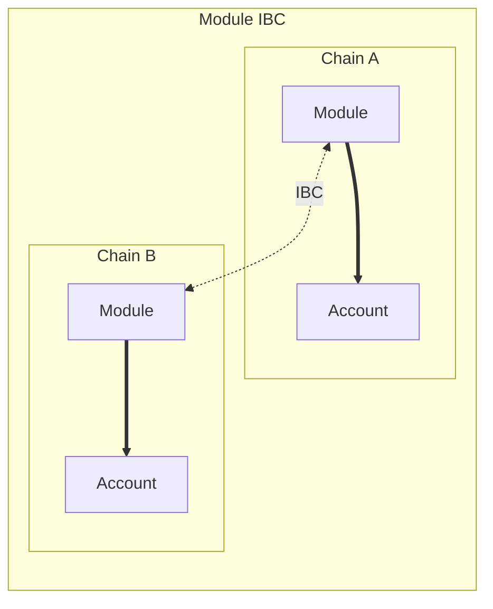

# Interchain Module Communication

## Introduction

[Interchain Abstract Accounts](./account-ibc.md) allow for executing actions on behalf of an Account on another chain. However, this mechanism doesn't allow modules installed on these Accounts to communicate securely by default. To clarify this statement, imagine an Abstract module "X" on a chain. This module wants to send a message to another module "Y" on a remote chain. The module on the remote chain wants to ensure that the message was sent by module X.

In order to do so, the developer could attempt to send his message through the user's Account using the Account IBC infrastructure. However, using this method it is impossible for module Y to verify that the content of the message was indeed sent by the origin module X. Executing actions through the Account is great for permissionless actions (like depositing assets into a protocol) but is unsuited for permissioned entry-points. So what now?

## Secure Interchain Module Communication

To allow modules to send messages securely to other modules across IBC, we have developed an Interchain Module Communication (IMC) protocol. IMC allows developers to send messages from a module directly to another module on a different chain. The module that receives the IBC message can then access the source module details. This way IMC allows interoperable permissioned actions between all Abstract modules.



Let's see how to create a contract with IMC capabilities by following the ping-pong example app that you can find <a href="https://github.com/AbstractSDK/abstract/blob/main/modules/contracts/apps/ping-pong/README.md" target="_blank">here</a>.

### Sending a message

In order to send a message, a module needs to interact with the `ibc-client` module. You can use the <a href="https://docs.rs/abstract-sdk/latest/abstract_sdk/struct.IbcClient.html" target="_blank">`IbcClient` API</a> to interact with the ibc-client. The example below shows how the ping-pong app sends a message to an instance of itself on another chain.

```rust
{{#include ../../../../modules/contracts/apps/ping-pong/src/handlers/execute.rs:ibc_client}}
```

- `opponent_chain` is the `TruncatedChainId` of the destination chain where the app is expected to be installed.
- `target_module` describes the module on which the message will be executed on the remote chain. In this case, it is another instance of the ping-pong app.
- `msg` is the message that will be executed on the remote module via a custom endpoint. We explain in the section about [receiving a message](#receiving-a-message) how this message is used by the targeted module.
- `callback_info` is used to request a callback once the packet has been received and acknowledged. We explain more about this behavior in the [acks and callbacks section](#acknowledgements-and-callbacks)

```admonish warning
When sending an IBC message, the call on the remote chain might fail. If you want to revert state based on that failure, you **HAVE** to use a `Callback`. If you don't register a callback and the remote call fails, local state will **NOT** be reverted.
```

### Receiving a message

In order for a module to receive a message coming from a remote Module, it needs to implement the [`module-ibc`](../get_started/module_builder.md#module-ibc) endpoint. The function signature for this endpoint is:

```rust
pub fn module_ibc(deps: DepsMut, env: Env, module: Module, source_module: ModuleIbcInfo, msg: Binary) -> Result<Response, Error>;
```

The `deps`, `env` and `module` variables are identical to the `execute` endpoint and should be clear to you by now. If not here are some links to more documentation:

- `deps` and `env` are described in the <a target="blank" href="https://docs.cosmwasm.com/docs/smart-contracts/contract-semantics">CosmWasm documentation</a>
- `module` (or `App` or `Adapter` usually) are described in the [Abstract SDK](../get_started/sdk.md) section of our docs

The `msg` variable contains the msg constructed by the module on the source chain. In this case the `PingPongIbcMsg`.

The `source_module` variable contains information about the module that sent the message, as well as the source chain information. This information can be used to assert the source of a message, like so:

```rust
{{#include ../../../../modules/contracts/apps/ping-pong/src/ibc/module.rs:module_ibc}}
```

For example, the above code will return an error if the source module doesn't match the receiving  module. This way only other ping-pong apps can call this ping-pong app!

### Callbacks

As mentioned callbacks can be added to the IBC flow progress or revert your contract's state depending on the packets execution result.

#### Callback Execution

If a callback was requested when sending a module IBC message, the callback will be executed wether the execution was successful or not. A callback message will be executed on the ̀[`ibc_callback`](../get_started/module_builder.md#ibc-callback) endpoint of the calling module. The function signature for this endpoint is:

```rust
pub fn ibc_callback(deps: DepsMut, env: Env, module: Module, callback: Callback, result: IbcResult,) -> Result<Response, Error>;
```

The `callback` variable contains a `msg: Binary` that is the encoded callback message that was provided to the callback on construction. In the ping-pong case this was `PingPongCallbackMsg::Pinged`.

The `result` contains the result data from the IBC packet execution. You can match against this result to assert that the remote execution was successful and roll back state if it was not.

## Specification of Interchain Module Communication

This part is not yet done. This is an outstanding TODO for the Abstract Team. If you're a module developer, you should have all the information you need in the previous sections. Good luck! 🚀
