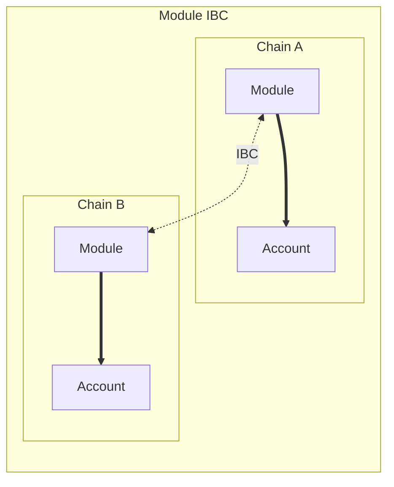

# Interchain Module Communication

## Introduction

[Interchain Abstract Accounts](./account-ibc.md) allow for executing actions on behalf of an Account on another chain. However, this mechanism doesn't allow modules installed on these Accounts to communicate securely by default. To clarify this statement, imagine an Abstract module "X" on a chain. This module wants to send a message to another module "Y" on a remote chain. The module on the remote chain wants to ensure that the message was sent by module X.

In order to do so, the developer could attempt to send his message through the user's Account using the Account IBC infrastructure. However, using this method it is impossible for module Y to verify that the content of the message was indeed sent by the origin module X. Executing actions through the Account is great for permissionless actions (like depositing assets into a protocol) but is unsuited for permissioned entry-points. So what now?

## Secure Interchain Module Communication

To allow modules to send messages securely to other modules across IBC, we have developed an Interchain Module Communication (IMC) protocol. IMC allows developers to send messages from a module directly to another module on a different chain. The module that receives the IBC message can then access the source module details. This way IMC allows interoperable permissioned actions between all Abstract modules.



Let's see how to create a contract with IMC capabilities.

### Sending a message

In order to send a message, a module needs to send a message on the current `ibc-client` module. To query the address of the `ibc-client` module, you can use the `app` or `adapter` variable available inside the endpoint like so:

```rust
let ibc_client_addr = app.modules(deps.as_ref()).module_address(IBC_CLIENT)?;
```

The [message](https://docs.rs/abstract-std/latest/abstract_std/ibc_client/enum.ExecuteMsg.html) looks like:

```rust
pub enum IbcClientExecuteMsg{
{{#include ../../../packages/abstract-std/src/native/ibc_client.rs:module-ibc-action}}
    ...,
}
```

- `host_chain` is the chain name of the destination chain
- `target_module` describes the module on which the message will be executed on the remote chain
- `msg` is the message that will be executed on the remote module. We explain in the section about [receiving a message](#receiving-a-message) how this message is used by the targeted module.
- `callback_info` is used to ask for a callback once the packet has been received and acknowledged. We explain more about this behavior in the [acks and callbacks section](#acknowledgements-and-callbacks)

```admonish warning
When sending an IBC message, the call on the remote chain might fail. If you want to revert state based on that failure, you **HAVE** to use a `Callback`. If you don't register a callback and the remote call fails, local state will **NOT** be reverted.
```

### Receiving a message

In order for a module to receive a message coming from a remote Module, it needs to implement the [`module-ibc`](../4_get_started/3_module_builder.md#module-ibc) endpoint. The function signature for this endpoint is:

```rust
pub fn module_ibc(deps: DepsMut, env: Env, module: Module, msg: ModuleIbcMsg) -> Result<Response, Error>;
```

The `deps`, `env` and `module` variables are identical to the `execute` endpoint and should be clear to you by now. If not here are some links to more documentation:

- `deps` and `env` are described in the <a target="blank" href="https://docs.cosmwasm.com/docs/smart-contracts/contract-semantics">CosmWasm documentation</a>
- `module` (or `App` or `Adapter` usually) are described in the [Abstract SDK](../4_get_started/4_sdk.md) section of our docs

The `msg` variable contains the msg constructed by the module on the source chain. The message is of type <a target="blank" href="https://docs.rs/abstract-std/latest/abstract_std/ibc/struct.ModuleIbcMsg.html">ModuleIbcMsg</a>:

```rust
{{#include ../../../packages/abstract-std/src/native/ibc.rs:module_ibc_msg}}
```

- `client_chain` is the name of the chain from which the call originates
- `source_module` describes the caller modules on the remote chains
- `msg` is the exact `Binary` data that was sent by the calling module on the client chain. How this data is used is up to the receiving module. As per CosmWasm conventions, we advise using `from_json` and `to_json_binary` for serialization and deserialization of this field into the expected type.

The most important thing to never forget here is access control. Similarly to the `MessageInfo` struct usually used in smart contracts or in other execution endpoints, the `source_module` variable can be used to permission some entry-points inside your module ibc interactions. A good practice is to verify the namespace and / or the module-id directly present inside the `source_module` variable. For example, the following code will return an error if the source module doesn't have the same namespace as the receiving module. That way, you make sure that no other module than what was published within your own namespace is able to send module ibc messages to your app:

```rust
cosmwasm_std::ensure_eq!(
    source_module.namespace,
    APP_NAMESPACE,
    ContractError::Unauthorized {}
);
```

### Acknowledgements and Callbacks

#### Callback Request

The `callback_info` field allows conditional message execution after the IBC packet process. When this field is used, the result of the IBC message execution will be forwarded to the [`ibc_callback`] handler of the calling contract. Here is the structure of the callback request:

```rust
{{#include ../../../packages/abstract-std/src/native/ibc.rs:callback-info}}
```

- `id` is used to identify the callback id that will be called after the ibc execution. This works similarly to the reply id but can be customized throughout the contract's lifecycle to indicate execution ordering.
- `msg` can contain additional context that will be provided to the callback endpoint alongside the execution result. This allows developers to give context to the endpoint when receiving the execution result.

#### Callback Execution

If a callback was requested when sending a module IBC message, the callback will be executed wether the execution was successful or not. A callback message will be executed on the ̀[`ibc_callback`](./4_get_started/3_module_builder.md#ibc-callback) endpoint of the calling module. The function signature for this endpoint is:

```rust
pub fn ibc_callback(deps: DepsMut, env: Env, module: Module, response_msg: IbcResponseMsg) -> Result<Response, Error>;
```

The `response_msg` variable of type <a target="blank" href="https://docs.rs/abstract-std/latest/abstract_std/ibc/struct.IbcResponseMsg.html">`IbcResponseMsg`</a> contains the context message that was provided when the IBC action was initiated along with the result of the execution.

```rust
{{#include ../../../packages/abstract-std/src/native/ibc.rs:response-msg}}
```

As described above, the following fields are copied from the `CallbackRequest`:

- `id` is used to identify the callback id that is called after the ibc execution.
- `msg` is additional information that was passed directly by the callback request.

The last field `result` contains information about the execution result of the ibc interaction. Matching on the structure, catching errors, reverting state changes, sending other messages, any execution is possible in this endpoint. This last part completes the interchain module communication flow and allows for full inter-operability!

## Specification of Interchain Module Communication

This part is not yet done. This is an outstanding TODO for the Abstract Team. If you're a module developer, you should have all the information you need in the previous sections. Good luck! 🚀
