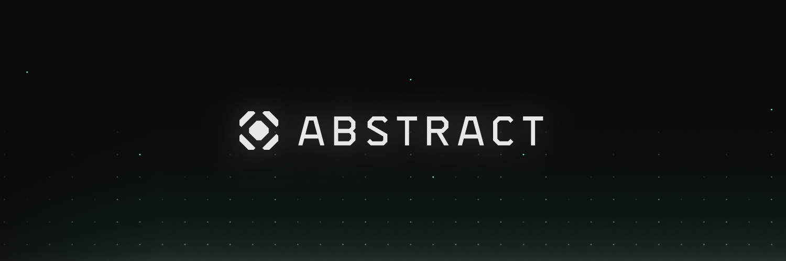

<!-- # The Abstract Development Platform -->
<!-- This page is a high-level overview of the Abstract Platform, not the SDK or any of our actual products. Hence we should stick to a vocabulary that is familiar to the reader. -->



Welcome to the Abstract Documentation!

**Abstract is an account-based application distribution and development platform. Our platform and tooling allow developers to build and scale their applications in a chain-abstracted manner.**

This first part of our documentation aims to provide you with the conceptual knowledge you need to understand the Abstract platform. The second part is a step-by-step guide on how to use the Abstract SDK to build your decentralized applications.

```admonish info
Want a TL;DR? Read a [high-level overview on the Abstract Platform](https://medium.com/abstract-money/a-high-level-overview-of-abstract-moneys-interchain-app-platform-d30813c7a1b4).
```

```admonish info
Prefer video content? Check out our [video library](./video_and_content/videos.md)!
```

## Who is Abstract For?

### Chains

For chains, we offer [chain abstraction](./framework/chain_abstraction.md) and [Abstract Accounts](./framework/account_abstraction.md) for effective user acquisition and engagement. Every chain with Abstract integrated has access to all apps developed with the [Abstract SDK](framework/abstract_sdk.md).

### Protocols

For protocols, we offer [on-chain application infrastructure](./platform/index.md) for single + multi-chain application development and lifecycle management. We also maintain [DeFi adapters](./modules/defi-adapters.md) for Dexes, lending markets, and staking providers.

### App Developers

For app developers, we offer the [Abstract SDK](framework/abstract_sdk.md), the leading CosmWasm framework designed for organizations and individual developers who want to build composable distributed applications in a fast, secure, and cost-effective manner.

We expect developers to be familiar with the Rust programming language and general programming concepts.

## Abstract Products

- **[Abstract SDK](framework/abstract_sdk.md)**: Modular CosmWasm framework for developing composable and scalable dapps agnostic to chains and protocols.

- **[Application Infrastructure](./platform/index.md)**: On-chain infrastructure for application management.

- **[Abstract Accounts](./framework/architecture.md)**: Modular smart-contract accounts.

- **[Abstract Interchain](framework/ibc.md)**: Interchain infrastructure and smart-contract abstractions for building multi-chain applications easily.

- **[Abstract.js](products/abstract_js.md)**: TypeScript and React libraries for building full-stack Abstract dapps.

- **[cw-orchestrator](products/cw_orchestrator.md)**: The most advanced CosmWasm scripting, testing, and deployment tool, written fully in Rust.


Together these products form a complete end-to-end development platform for distributed applications.

## How to Navigate the Docs

You can read the documentation in the order it is presented, or you can jump to the section that's most relevant to you.

## Help and Support

If you have any questions or ideas you want to discuss about our products, please contact us
on <a href="https://discord.com/invite/uch3Tq3aym" target="_blank">Discord</a>.

## Want to make Abstract better?

Look at the
[Contributing & Community](./contributing.md) section if you want to get involved.

### Links

<ul>
    <li><a href="https://abstract.money/" target="_blank">Website</a></li>
    <li><a href="https://github.com/AbstractSDK" target="_blank">Github</a></li>
    <li><a href="https://medium.com/@abstractmoney" target="_blank">Medium Blog</a></li>
    <li><a href="https://docs.abstract.money/" target="_blank">Docs</a></li>
    <li><a href="https://console.abstract.money" target="_blank">Account Console</a></li>
    <li><a href="https://api.abstract.money/" target="_blank">Graphql API Explorer</a></li>
    <li><a href="https://xion.abstract.money/" target="_blank">Chain Abstraction Demo</a></li>
</ul>
