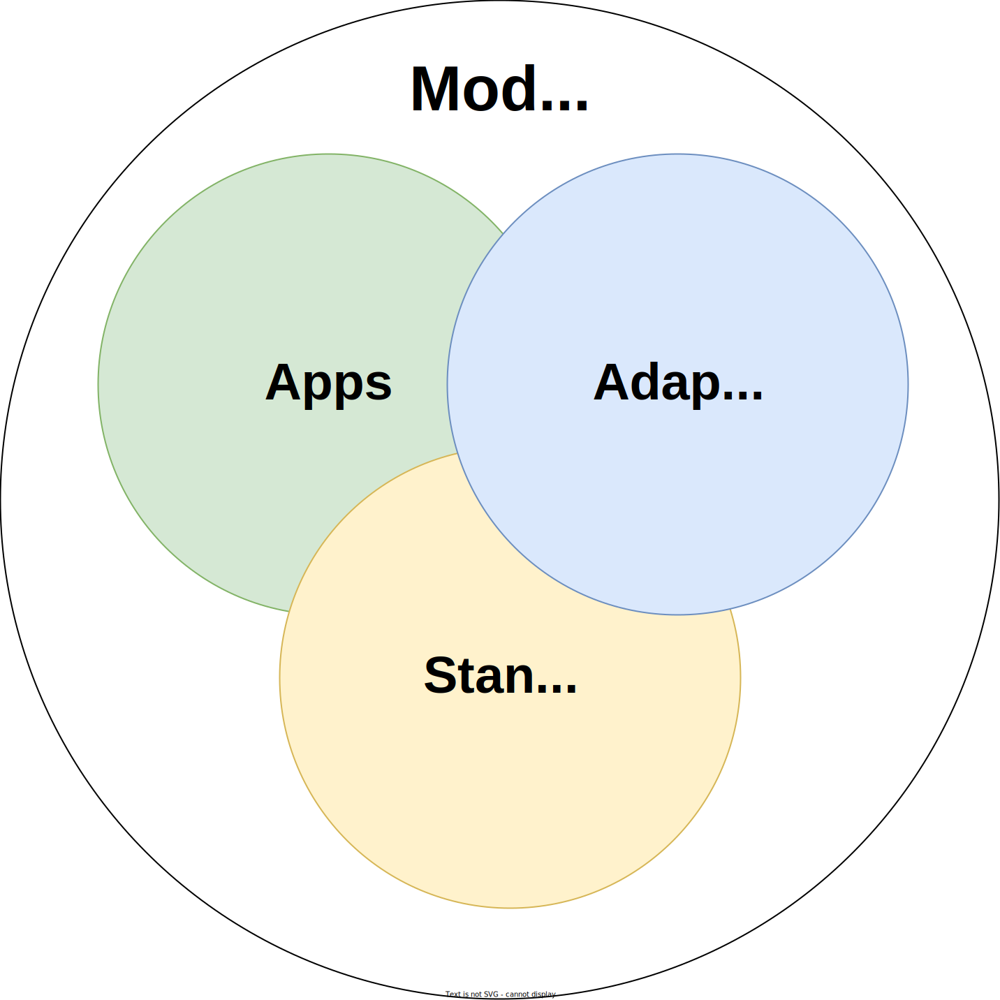

# Modules

The following modules are offered by Abstract and can be used in your applications to add additional functionality. Before you continue, make sure to learn about [what modules are](../3_framework/5_modules.md).

## Adapters

- [CW Staking](./cw-staking.md)
- [Dex](./dex.md)
- [Lending Market](./lending-market.md)

## App Modules

- [Subscription](./subscription.md)
- [ETF](./etf.md)

Also check out [Awesome Abstract](https://github.com/AbstractSDK/awesome-abstract) to see modules that other teams may have built.
