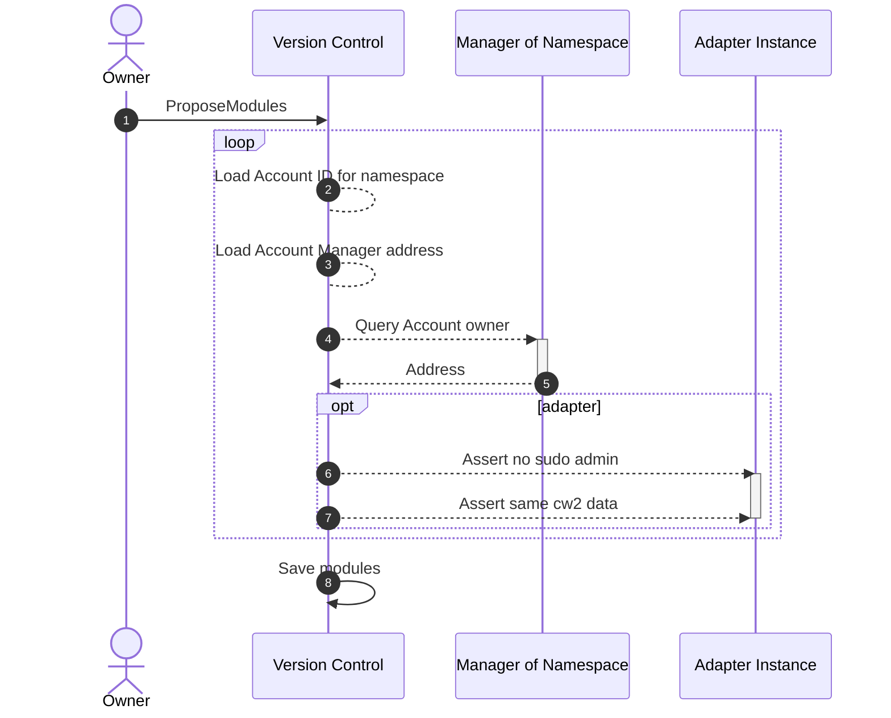

# Version Control

The Version Control contract acts as the registry for all modules and accounts within the Abstract platform. Abstract Accounts can use it to claim namespaces and register their modules. The Version Control contract allows modules to be queried by its namespace, name, and version, returning its reference which may be a code id or address.

## Namespaces

An account's namespace is a unique identifier that is used to provide a publishing domain for modules and a human readable name for any Abstract Account.

Namespaces are claimed by an account and can be used to publish modules. Namespaces are unique and can only be claimed once. An account can only claim one namespace.

When a namespace is removed from an account, any modules published under that namespace will be removed from the registry. This is to prevent malicious actors from registering modules under trusted namespaces.

## Propose Modules

Developers that wish to publish modules to the Abstract platform need to call `ProposeModules` on the Version Control contract. The modules will subsequently be reviewed by the Abstract platform for registration.

```admonish info
For documentation on how to register modules, see [Module Deployment](../get_started/module_deployment.md)
```

Modules cannot be registered without their namespaces being claimed by an Account. This is to prevent malicious actors from registering modules under trusted namespaces.

Below details the assertion process.



```admonish warning
For mainnet deployment proposed modules are reviewed by the Abstract team. To get them approved, reach out to us on [Discord](https://discord.com/invite/uch3Tq3aym). For testnet deployment there is no review process.
```
