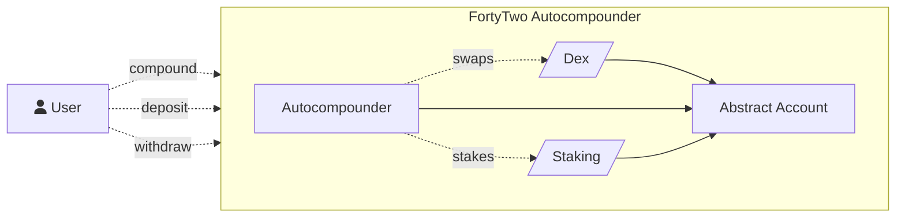

# FortyTwo Autocompounder

FortyTwo, winner of the Cosmoverse 2023 pitch contest, aims to simplify access to the Cosmos ecosystem, acting as an
entry point and yield aggregator for all IBC-enabled chains. It provides a unified user interface for yield farming, liquidity optimization, and portfolio tracking.

FortyTwo built a dex-agnostic autocompounder application on Abstract, allowing for autocompounding any LP position in the interchain ecosystem.

## Modules

- [Dex Adapter](../modules/dex.md)
- [Staking Adapter](../modules/cw-staking.md)

## Architecture

For more details about FortyTwo, please visit their <a href="https://www.fortytwo.money/" target="_blank">official
website</a>.
